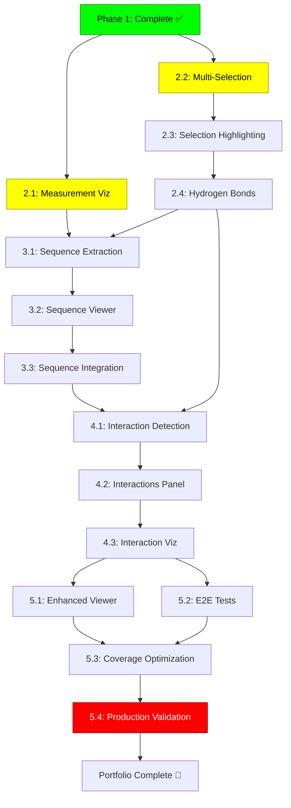

# GOAP Execution Summary - LAB Visualizer Portfolio Completion

**Quick Reference Guide for AI Agent Orchestration**

---

## 🎯 Goal State

```typescript
GOAL = {
  phase1: true,   // ✅ Complete
  phase2: true,   // 📋 Target
  phase3: true,   // 📋 Target
  phase4: true,   // 📋 Target
  phase5: true,   // 📋 Target
  coverage: ≥80%, // Current: ~60%
  production: true
}
```

---

## 📊 Current State → Goal State

| Metric | Current | Goal | Gap |
|--------|---------|------|-----|
| **Line Coverage** | 60% | 80% | +20% |
| **Function Coverage** | 60% | 80% | +20% |
| **Branch Coverage** | 50% | 75% | +25% |
| **Statement Coverage** | 60% | 80% | +20% |
| **Test Files** | 39 | 84 | +45 |
| **Phases Complete** | 1/5 | 5/5 | 4 phases |
| **Production Ready** | No | Yes | Validation needed |

---

## 🚀 Action Dependency Graph



---

## ⚡ Parallel Execution Opportunities

### Week 1-2 (Phase 2)
```
Agent 1: action-2.1-measurement-viz (12-16h)
Agent 2: action-2.2-multi-selection (8-10h)
         ↓
Agent 1: action-2.3-selection-highlighting (8-10h)
         ↓
Agent 1: action-2.4-hydrogen-bonds (12-16h)
```
**Speedup:** 25% time reduction via parallel execution

### Week 7 (Phase 5)
```
Agent 1: action-5.1-enhanced-viewer (8-10h)
Agent 2: action-5.2-e2e-tests (10-14h)
         ↓
Agent 1: action-5.3-coverage-optimization (8-12h)
         ↓
Agent 1: action-5.4-production-validation (12-16h)
```
**Speedup:** 30% time reduction

---

## 📅 Weekly Milestones

### Week 1-2: Visual Enhancements (Phase 2)
**Coverage Target:** 60% → 68%

✅ **Milestone 2.A** (Week 1):
- [ ] 3D measurement visualization working
- [ ] Multi-selection system functional
- [ ] +5% coverage increase

✅ **Milestone 2.B** (Week 2):
- [ ] Selection highlighting active
- [ ] Hydrogen bonds detected & visualized
- [ ] +5% coverage increase

**Deliverables:**
- 3D lines and labels for measurements
- Multi-atom selection system
- Green/magenta highlighting
- H-bond dashed yellow lines

---

### Week 3-4: Sequence Viewer (Phase 3)
**Coverage Target:** 68% → 76%

✅ **Milestone 3.A** (Week 3):
- [ ] Sequence extraction API complete
- [ ] +2% coverage increase

✅ **Milestone 3.B** (Week 3-4):
- [ ] SequenceViewer component built
- [ ] Bidirectional 3D sync working
- [ ] +6% coverage increase

**Deliverables:**
- Sequence display for all chains
- Secondary structure annotations
- Click residue → 3D highlight/center
- Click 3D → sequence highlight
- <50ms sync latency

---

### Week 5-6: Interactions Panel (Phase 4)
**Coverage Target:** 76% → 86%

✅ **Milestone 4.A** (Week 5):
- [ ] All interaction detection algorithms complete
- [ ] H-bonds, salt bridges, hydrophobic, pi-pi
- [ ] +5% coverage increase

✅ **Milestone 4.B** (Week 6):
- [ ] InteractionsPanel UI complete
- [ ] 3D visualization for all interaction types
- [ ] +5% coverage increase

**Deliverables:**
- Detection algorithms with >90% accuracy
- Interactive panel with filtering
- Color-coded 3D representations
- <2s detection time

---

### Week 7: Integration & Production (Phase 5)
**Coverage Target:** 86% → 80%+ (optimization to meet threshold)

✅ **Milestone 5.A** (Days 1-2):
- [ ] EnhancedMolStarViewer unified component
- [ ] E2E test suite complete
- [ ] +3% coverage increase

✅ **Milestone 5.B** (Days 3-5):
- [ ] Coverage optimization to ≥80%
- [ ] Production validation passed
- [ ] All quality gates green

**Deliverables:**
- Unified component with feature flags
- Comprehensive E2E tests
- ≥80% coverage across all metrics
- Production build validated
- Portfolio-ready documentation

---

## 🧪 TDD Workflow (Per Action)

```
┌─────────────────────────────────────────────────┐
│ 1. WRITE TESTS FIRST (Red)                     │
│    - Unit tests for components/hooks           │
│    - Integration tests for services            │
│    - E2E tests for workflows                   │
│    Time: 25-35% of action                      │
└─────────────────────────────────────────────────┘
                    ↓
┌─────────────────────────────────────────────────┐
│ 2. IMPLEMENT (Green)                            │
│    - Make tests pass                            │
│    - Follow existing patterns                   │
│    - Commit frequently                          │
│    Time: 50-60% of action                      │
└─────────────────────────────────────────────────┘
                    ↓
┌─────────────────────────────────────────────────┐
│ 3. REFACTOR & VALIDATE                          │
│    - Clean up code                              │
│    - Run full test suite                       │
│    - Performance testing                        │
│    - Manual testing                             │
│    Time: 10-15% of action                      │
└─────────────────────────────────────────────────┘
                    ↓
┌─────────────────────────────────────────────────┐
│ 4. DOCUMENT                                     │
│    - Update API docs                            │
│    - Add usage examples                         │
│    - Update architecture docs                   │
│    Time: 5-10% of action                       │
└─────────────────────────────────────────────────┘
```

---

## 🎯 Critical Path (A* Optimal)

**Critical Actions (Cannot be parallelized):**

1. `action-2.1-measurement-viz` (16h) → Enables 3D visualization
2. `action-2.4-hydrogen-bonds` (16h) → Required for Phase 4
3. `action-3.2-sequence-viewer` (18h) → Core Phase 3 feature
4. `action-4.1-interaction-detection` (24h) → Core Phase 4 feature
5. `action-5.3-coverage-optimization` (12h) → Critical for goal
6. `action-5.4-production-validation` (16h) → Final gate

**Critical Path Total:** 102 hours (13 days @ 8h/day)

**With Parallel Execution:** 136-178 hours → **17-22 days**

---

## 📈 Coverage Progression Chart

```
100% │
     │                                            ┌─── Goal: 80%
 90% │                                        ┌───┘
     │                                    ┌───┘
 80% │                                ┌───┘ Phase 5
     │                            ┌───┘
 70% │                        ┌───┘ Phase 4
     │                    ┌───┘
 60% │ Phase 1 ──────┬───┘ Phase 3
     │               │Phase 2
 50% │               │
     │               │
 40% │               │
     └───────────────┴─────────────────────────────
       Current    W1-2   W3-4   W5-6    W7

     Phase:      1      2      3      4      5
     Coverage:  60%    68%    76%    86%    80%+
```

---

## 🚨 Risk Triggers & Mitigation

### Trigger 1: Coverage Not Increasing
**Detect:** Daily coverage checks
**Mitigation:**
- Immediately write tests for uncovered code
- Use `action-5.3-coverage-optimization` buffer

### Trigger 2: Performance Degradation >10% FPS
**Detect:** Performance tests in each action
**Mitigation:**
- Revert changes
- Profile with DevTools
- Implement throttling/debouncing
- Use LOD system

### Trigger 3: MolStar API Integration Issues
**Detect:** Implementation blockers
**Mitigation:**
- Reference MolStar examples
- Prototype in isolation
- Ask for help in MolStar community

### Trigger 4: Time Overrun
**Detect:** Action exceeds estimated hours by 25%
**Mitigation:**
- Re-scope action (MVP approach)
- Defer non-critical features
- Parallelize more aggressively

---

## 🛠️ Daily Agent Workflow

### Morning Routine (2-3 hours)
```bash
# 1. Pull latest
git pull origin main

# 2. Run full test suite
npm run test

# 3. Check coverage
npm run test:coverage

# 4. Write tests for today's action
# Example: tests/components/viewer/interactive/MeasurementVisualization.test.tsx

# 5. Commit test stubs
git add tests/
git commit -m "test: Add test stubs for measurement visualization"
```

### Midday Routine (4-5 hours)
```bash
# 6. Implement functionality (Red → Green → Refactor)
# Example: src/services/molstar/measurement-renderer.ts

# 7. Run tests continuously
npm run test:watch

# 8. Commit working features
git add src/ tests/
git commit -m "feat: Implement 3D measurement visualization"

# 9. Manual testing
npm run dev
# Test in browser
```

### Afternoon Routine (1-2 hours)
```bash
# 10. Performance testing
npm run test:e2e -- --grep performance

# 11. Update documentation
# Example: docs/architecture/enhanced-molstar-service-api.md

# 12. Final commit
git add docs/
git commit -m "docs: Update MolStar service API documentation"

# 13. Push to remote
git push origin main

# 14. Update progress tracker
# Mark completed tasks in TodoWrite
```

---

## 🎓 Agent Handoff Protocol

### When Starting an Action
1. **Read Prerequisites:**
   - Full GOAP plan: `docs/GOAP_IMPLEMENTATION_PLAN.md`
   - Action specification (TDD workflow section)
   - Related architecture docs

2. **Verify Preconditions:**
   - All dependency actions complete
   - Tests passing
   - No blockers

3. **Set Up Environment:**
   ```bash
   npm install
   npm run test
   npm run typecheck
   ```

4. **Create Test Stubs:**
   - Write test file structure
   - Define test cases
   - Commit stubs

### During Action Execution
1. **Follow TDD Cycle:**
   - Write test → Red
   - Implement → Green
   - Refactor → Clean
   - Document → Complete

2. **Commit Frequently:**
   - Every 1-2 hours
   - Meaningful commit messages
   - Keep tests passing

3. **Monitor Metrics:**
   - Coverage increasing
   - Performance maintained
   - No new TypeScript errors

### When Completing an Action
1. **Validation Checklist:**
   - [ ] All tests passing
   - [ ] Coverage increased by target %
   - [ ] Performance targets met
   - [ ] Manual testing complete
   - [ ] Documentation updated

2. **Handoff Document:**
   ```markdown
   ## Action: action-X.Y-name
   **Status:** ✅ Complete
   **Coverage Increase:** +X%
   **Tests Added:** X new tests
   **Known Issues:** None
   **Next Action:** action-X.Y+1-name
   ```

3. **Final Commit:**
   ```bash
   git add -A
   git commit -m "feat: Complete action-X.Y-name

   - Implemented [feature]
   - Tests: X passing
   - Coverage: +X%
   - Performance: [metrics]

   Closes #issue-number"

   git push origin main
   ```

---

## 📊 Success Metrics Dashboard

### Phase 2 Success
```yaml
✅ Measurements visualized in 3D: ___/3 types (distance, angle, dihedral)
✅ Multi-selection working: ___ (yes/no)
✅ Selection highlighting: ___ (yes/no)
✅ H-bonds detected & visualized: ___ (yes/no)
✅ Coverage: ___% (target: 68%)
✅ Performance: ___% FPS impact (target: <10%)
✅ Tests passing: ___/54 (target: 100%)
```

### Phase 3 Success
```yaml
✅ Sequence extraction: ___ chains extracted
✅ SequenceViewer rendered: ___ (yes/no)
✅ Sync latency: ___ms (target: <50ms)
✅ Sequence load time: ___ms (target: <500ms)
✅ Coverage: ___% (target: 76%)
✅ Tests passing: ___/64 (target: 100%)
```

### Phase 4 Success
```yaml
✅ H-bond detection accuracy: ___% (target: >95%)
✅ Salt bridge accuracy: ___% (target: >90%)
✅ Hydrophobic contacts: ___ (working/not working)
✅ Pi-pi stacking: ___ (working/not working)
✅ Detection time: ___s (target: <2s)
✅ Coverage: ___% (target: 86%)
✅ Tests passing: ___/76 (target: 100%)
```

### Phase 5 Success
```yaml
✅ E2E tests: ___/__ passing (target: 100%)
✅ Coverage: Lines ___%, Functions ___%, Branches ___%, Statements ___%
   (targets: 80%, 80%, 75%, 80%)
✅ Bundle size: ___KB increase (target: <150KB)
✅ Lighthouse score: ___ (target: >90)
✅ TypeScript errors: ___ (target: 0)
✅ Production validated: ___ (yes/no)
✅ Tests passing: ___/84 (target: 100%)
```

---

## 🚀 Quick Start Commands

### For Agent Starting Phase 2
```bash
# 1. Navigate to project
cd /mnt/c/Users/brand/Development/Project_Workspace/active-development/lab_visualizer

# 2. Read GOAP plan
cat docs/GOAP_IMPLEMENTATION_PLAN.md

# 3. Check current state
npm run test:coverage
git status

# 4. Start first action
mkdir -p tests/services/molstar
touch tests/services/molstar/measurement-renderer.test.ts

# 5. Write tests (follow action-2.1 TDD workflow)
```

### For Agent Starting Phase 3
```bash
# Prerequisites: Phase 2 complete
# Start: action-3.1-sequence-extraction

mkdir -p tests/services/molstar
touch tests/services/molstar/sequence-extractor.test.ts

# Write tests first...
```

### For Agent Starting Phase 4
```bash
# Prerequisites: Phase 3 complete
# Start: action-4.1-interaction-detection

mkdir -p tests/services/interactions
touch tests/services/interactions/interaction-detector.test.ts

# Write comprehensive algorithm tests...
```

### For Agent Starting Phase 5
```bash
# Prerequisites: Phase 4 complete
# Start: action-5.1-enhanced-viewer and action-5.2-e2e-tests (parallel)

# Agent 1:
touch tests/components/viewer/EnhancedMolStarViewer.test.tsx

# Agent 2:
mkdir -p e2e
touch e2e/interactive-features.spec.ts

# Parallel execution...
```

---

## 📖 Key Documentation References

1. **GOAP Plan (This Document):** `docs/GOAP_IMPLEMENTATION_PLAN.md`
2. **Architecture Index:** `docs/architecture/INTERACTIVE_FEATURES_INDEX.md`
3. **System Design:** `docs/architecture/interactive-features-system-design.md`
4. **Component Specs:** `docs/architecture/component-specifications.md`
5. **Implementation Guide:** `docs/architecture/interactive-features-implementation.md`
6. **MolStar API:** `docs/architecture/enhanced-molstar-service-api.md`
7. **Phase 1 Status:** `docs/INTERACTIVE_FEATURES_IMPLEMENTED.md`

---

## ✅ Portfolio Completion Criteria

**ALL of the following must be ✅ for portfolio completion:**

### Technical Criteria
- [ ] All 5 phases complete (14 actions)
- [ ] Test coverage ≥80% (lines, functions, statements), ≥75% (branches)
- [ ] All 84+ tests passing
- [ ] Zero TypeScript errors
- [ ] Zero console errors/warnings
- [ ] Performance: <10% FPS degradation
- [ ] Bundle size: <150KB increase

### Quality Criteria
- [ ] E2E tests passing (all user workflows)
- [ ] Lighthouse performance score >90
- [ ] WCAG 2.1 AA accessibility compliance
- [ ] Security scan clean (no vulnerabilities)
- [ ] Cross-browser tested (Chrome, Firefox, Safari, Edge)

### Documentation Criteria
- [ ] README.md complete
- [ ] API documentation complete
- [ ] User guide complete
- [ ] Architecture docs updated
- [ ] Code examples provided

### Production Criteria
- [ ] Production build validated
- [ ] CI/CD quality gates passing
- [ ] Deployment checklist complete
- [ ] Known limitations documented
- [ ] Support resources documented

---

**When ALL criteria are ✅, the LAB Visualizer is PORTFOLIO READY! 🎉**

**Estimated Completion Date:** 2026-02-13 (7 weeks from 2025-12-26)

---

**Document Version:** 1.0
**Created:** 2025-12-26
**Purpose:** Quick reference for AI agents executing GOAP plan
**Related:** GOAP_IMPLEMENTATION_PLAN.md (detailed specification)
