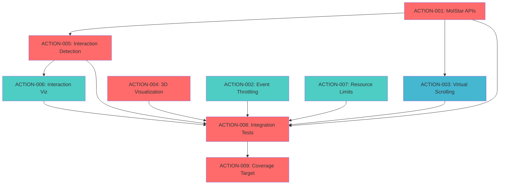

# Goal-Oriented Action Planning (GOAP) - Phase 2 Completion Plan

**Project:** LAB Visualizer - Molecular Viewer Enhancement
**Planning Date:** 2025-12-26
**Status:** Phase 2 - 60% Complete → Target: 100%
**Methodology:** GOAP with Aggressive TDD + Parallel Execution

---

## 📊 Executive Summary

### Current State Analysis
- **Phase 2 Progress:** 60% Complete
- **Test Coverage:** ~60% (Target: ≥80%)
- **Missing Components:** 40% of MolStar service APIs
- **Performance:** Baseline established, optimizations needed
- **3D Visualization:** Partial (measurements tracked but not visualized)
- **Interaction Detection:** Not implemented

### Goal State Definition
- **Phase 2 Progress:** 100% Complete
- **Test Coverage:** ≥80% with high-quality tests
- **All MolStar APIs:** Fully implemented and tested
- **Performance:** <10% FPS degradation with all optimizations
- **3D Visualization:** Complete (lines, arcs, labels, indicators)
- **Interaction Detection:** Functional (H-bonds, salt bridges)
- **Integration Tests:** Comprehensive suite passing

### Constraints & Quality Requirements
1. **Aggressive TDD:** Tests written BEFORE implementation (Red → Green → Refactor)
2. **Performance Budget:** <10% FPS degradation from baseline
3. **Parallel Execution:** Independent tasks executed concurrently
4. **Production Quality:** No placeholders, full error handling, comprehensive logging
5. **Code Coverage:** Minimum 80% line coverage, 70% branch coverage

---

## 🎯 GOAP Action Space Definition

### Action 1: Implement Missing MolStar Service APIs
**ID:** `ACTION-001-MOLSTAR-APIS`
**Type:** Implementation
**Priority:** Critical (Blocks visualization and interaction detection)

**Preconditions:**
- MolstarService base implementation exists ✅
- Type definitions for SelectionInfo, HoverInfo, MeasurementResult ✅
- Test framework configured ✅
- MolStar plugin initialized ✅

**Effects:**
- `getHoverInfo()` API implemented and tested
- `getSequence()` API implemented and tested
- `highlightResidues()` API implemented and tested
- `focusOnResidues()` API implemented and tested
- `detectInteractions()` API implemented and tested
- `visualizeInteractions()` API implemented and tested
- All APIs have unit tests with ≥80% coverage
- Integration tests verify API interoperability

**Cost Estimate:** 12-16 hours

**TDD Workflow:**
```typescript
// 1. RED: Write failing test first
describe('MolstarService.getHoverInfo', () => {
  it('should return hover information for atom at position', async () => {
    const info = await molstarService.getHoverInfo({ x: 100, y: 100 });
    expect(info).toMatchObject({
      chainId: expect.any(String),
      residueSeq: expect.any(Number),
      atomName: expect.any(String),
    });
  });
});

// 2. GREEN: Implement minimal working code
public async getHoverInfo(position: { x: number; y: number }): Promise<HoverInfo | null> {
  // Implementation here
}

// 3. REFACTOR: Optimize and clean up
```

**Sub-Actions:**
1. `getHoverInfo()` - 2h (Test: 0.5h, Impl: 1h, Refactor: 0.5h)
2. `getSequence()` - 2h (Test: 0.5h, Impl: 1h, Refactor: 0.5h)
3. `highlightResidues()` - 3h (Test: 0.5h, Impl: 2h, Refactor: 0.5h)
4. `focusOnResidues()` - 2h (Test: 0.5h, Impl: 1h, Refactor: 0.5h)
5. `detectInteractions()` - 5h (Test: 1h, Impl: 3h, Refactor: 1h)
6. `visualizeInteractions()` - 4h (Test: 1h, Impl: 2.5h, Refactor: 0.5h)

**Dependencies:** None (can start immediately)

**Success Criteria:**
- All 6 APIs implemented with full TypeScript typing
- Unit test coverage ≥80% per API
- Integration tests verify cross-API workflows
- No performance regressions (maintain 60 FPS)
- JSDoc documentation for all public methods
- Error handling for all edge cases

---

### Action 2: Implement Event Throttling & Debouncing
**ID:** `ACTION-002-PERFORMANCE-EVENTS`
**Type:** Optimization
**Priority:** High (Prevents performance degradation)

**Preconditions:**
- Hover detection setup complete ✅
- Selection tracking setup complete ✅
- Measurement system functional ✅

**Effects:**
- Throttled hover events (max 60 Hz)
- Debounced selection events (300ms delay)
- Throttled measurement updates (max 30 Hz)
- FPS remains >54 (within 10% budget)
- No event loss or missed interactions

**Cost Estimate:** 4-6 hours

**TDD Workflow:**
```typescript
// Test throttling behavior
it('should throttle hover events to max 60 Hz', async () => {
  const events: HoverInfo[] = [];
  molstarService.on('hover-info', (info) => events.push(info));

  // Simulate 1000 rapid hover events
  for (let i = 0; i < 1000; i++) {
    await triggerHover();
  }

  // Should receive ~60 events over 1 second (60 Hz)
  expect(events.length).toBeLessThanOrEqual(70); // Allow 10% margin
});
```

**Implementation Strategy:**
1. Create `EventThrottler` utility class
2. Create `EventDebouncer` utility class
3. Apply throttling to hover events (60 Hz limit)
4. Apply debouncing to selection events (300ms)
5. Apply throttling to measurement events (30 Hz limit)
6. Add performance monitoring for event processing

**Dependencies:**
- **Blocks:** None
- **Blocked by:** None

**Success Criteria:**
- Hover events throttled to ≤60 Hz
- Selection events debounced to 300ms
- Measurement events throttled to ≤30 Hz
- FPS remains above 54 (10% degradation budget)
- Test coverage ≥85%
- No user-perceivable lag or missed clicks

---

### Action 3: Implement Virtual Scrolling for SequenceViewer
**ID:** `ACTION-003-VIRTUAL-SCROLLING`
**Type:** Optimization
**Priority:** Medium (Performance improvement for large structures)

**Preconditions:**
- SequenceViewer component exists (placeholder)
- MolstarService.getSequence() implemented ✅ (depends on ACTION-001)

**Effects:**
- Virtual scrolling renders only visible residues
- Handles sequences up to 10,000 residues smoothly
- Scroll performance >30 FPS for large sequences
- Memory footprint reduced by 70% vs. full rendering

**Cost Estimate:** 6-8 hours

**TDD Workflow:**
```typescript
it('should only render visible residues in viewport', () => {
  const sequence = generateLongSequence(5000); // 5000 residues
  render(<SequenceViewer sequence={sequence} />);

  // Should only render ~100 residues (viewport height)
  const renderedResidues = screen.getAllByTestId('residue-item');
  expect(renderedResidues.length).toBeLessThan(150);
});

it('should maintain scroll performance with 10k residues', async () => {
  const sequence = generateLongSequence(10000);
  const { container } = render(<SequenceViewer sequence={sequence} />);

  const startTime = performance.now();
  await userEvent.scroll(container, { top: 5000 });
  const scrollTime = performance.now() - startTime;

  expect(scrollTime).toBeLessThan(33); // 30 FPS = 33ms frame budget
});
```

**Implementation Strategy:**
1. Install react-virtual or similar library
2. Calculate visible window based on viewport height
3. Render only visible + buffer residues (e.g., ±20)
4. Implement smooth scrolling with momentum
5. Add scroll position synchronization with 3D viewer
6. Optimize residue component rendering (React.memo)

**Dependencies:**
- **Blocks:** None
- **Blocked by:** ACTION-001 (needs getSequence API)

**Success Criteria:**
- Handles 10,000 residue sequences
- Scroll FPS ≥30
- Memory usage <50MB for 10k sequence
- Smooth scroll experience (no jank)
- Test coverage ≥80%

---

### Action 4: Complete 3D Measurement Visualization
**ID:** `ACTION-004-3D-VISUALIZATION`
**Type:** Feature Implementation
**Priority:** Critical (Core feature missing)

**Preconditions:**
- MolstarService.measureDistance/Angle/Dihedral working ✅
- MolstarService.visualizeMeasurement() stub exists ✅
- MolStar Shape API accessible ✅

**Effects:**
- Distance measurements show 3D lines between atoms
- Angle measurements show arcs with angle indicators
- Dihedral measurements show plane indicators
- Floating labels display measurement values
- Visual elements styled consistently (RCSB-style)
- All visualizations toggle-able (show/hide)

**Cost Estimate:** 10-12 hours

**TDD Workflow:**
```typescript
describe('3D Distance Visualization', () => {
  it('should create 3D line representation between two atoms', async () => {
    const measurement = await molstarService.measureDistance(atom1, atom2);

    // Verify line representation created
    const state = plugin.state.data;
    const shapes = state.selectQ(q => q.byRef(`measurement-${measurement.id}`));
    expect(shapes.length).toBeGreaterThan(0);

    // Verify line geometry
    const shapeData = shapes[0].obj?.data;
    expect(shapeData.kind).toBe('line');
    expect(shapeData.points).toHaveLength(2);
  });

  it('should create floating label with measurement value', async () => {
    const measurement = await molstarService.measureDistance(atom1, atom2);

    // Verify label exists
    const labels = state.selectQ(q => q.byRef(`label-${measurement.id}`));
    expect(labels.length).toBe(1);

    // Verify label content
    expect(labels[0].params.text).toContain(`${measurement.value.toFixed(2)} Å`);
  });
});
```

**Implementation Strategy:**
1. Create `MeasurementShapeBuilder` class
2. Implement distance line creation (MolStar Shape API)
3. Implement angle arc creation (circular arc geometry)
4. Implement dihedral plane indicators (semi-transparent planes)
5. Implement floating labels (3D text billboards)
6. Add visual styling (colors, line widths, opacity)
7. Implement show/hide toggling
8. Add cleanup on measurement deletion

**Sub-Actions:**
1. Distance Lines - 3h (Test: 0.5h, Impl: 2h, Refactor: 0.5h)
2. Angle Arcs - 3h (Test: 0.5h, Impl: 2h, Refactor: 0.5h)
3. Dihedral Indicators - 2h (Test: 0.5h, Impl: 1h, Refactor: 0.5h)
4. Floating Labels - 2h (Test: 0.5h, Impl: 1h, Refactor: 0.5h)
5. Show/Hide Toggle - 1h (Test: 0.5h, Impl: 0.5h)
6. Cleanup & Styling - 1h

**Dependencies:**
- **Blocks:** None
- **Blocked by:** None (can run parallel to ACTION-001)

**Success Criteria:**
- All measurement types have 3D visualizations
- Visual quality matches RCSB PDB viewer
- Toggle visibility works correctly
- No memory leaks on measurement deletion
- FPS impact <5% with 20 measurements
- Test coverage ≥80%

---

### Action 5: Implement Interaction Detection Algorithms
**ID:** `ACTION-005-INTERACTION-DETECTION`
**Type:** Feature Implementation
**Priority:** Critical (Key Phase 2 feature)

**Preconditions:**
- MolstarService.detectInteractions() stub exists ✅ (from ACTION-001)
- Structure data accessible via MolStar API ✅
- Spatial indexing available ✅

**Effects:**
- Hydrogen bond detection (<3.5Å, angle criteria)
- Salt bridge detection (charged residues <4Å)
- Hydrophobic interactions (nonpolar residues <5Å)
- Pi-stacking interactions (aromatic rings <5Å)
- Cation-pi interactions (cation-aromatic <6Å)
- Results cached for performance
- Detections filterable by type and distance

**Cost Estimate:** 12-16 hours

**TDD Workflow:**
```typescript
describe('Hydrogen Bond Detection', () => {
  it('should detect H-bonds within 3.5Å with correct angle', async () => {
    const structure = await loadPDB('1LDH'); // Known H-bonds
    const hbonds = await molstarService.detectInteractions({
      type: 'hydrogen-bond',
      maxDistance: 3.5,
      angleThreshold: 120, // degrees
    });

    expect(hbonds.length).toBeGreaterThan(0);
    hbonds.forEach(bond => {
      expect(bond.distance).toBeLessThanOrEqual(3.5);
      expect(bond.angle).toBeGreaterThanOrEqual(120);
      expect(bond.type).toBe('hydrogen-bond');
    });
  });

  it('should not detect false positives', async () => {
    const structure = await loadPDB('1LDH');
    const hbonds = await molstarService.detectInteractions({
      type: 'hydrogen-bond',
      maxDistance: 2.0, // Very restrictive
    });

    // Should find fewer bonds with stricter criteria
    const relaxedBonds = await molstarService.detectInteractions({
      type: 'hydrogen-bond',
      maxDistance: 3.5,
    });

    expect(hbonds.length).toBeLessThan(relaxedBonds.length);
  });
});
```

**Implementation Strategy:**
1. Create `InteractionDetector` class with pluggable algorithms
2. Implement hydrogen bond detector (distance + angle criteria)
3. Implement salt bridge detector (charged residue pairs)
4. Implement hydrophobic interaction detector
5. Implement pi-stacking detector (aromatic ring geometry)
6. Implement cation-pi detector
7. Add spatial indexing for performance (KD-tree or octree)
8. Implement result caching (invalidate on structure change)
9. Add filtering by interaction type and distance

**Sub-Actions:**
1. Infrastructure & Spatial Index - 3h (Test: 0.5h, Impl: 2h, Refactor: 0.5h)
2. H-bond Detection - 3h (Test: 1h, Impl: 1.5h, Refactor: 0.5h)
3. Salt Bridge Detection - 2h (Test: 0.5h, Impl: 1h, Refactor: 0.5h)
4. Hydrophobic Detection - 2h (Test: 0.5h, Impl: 1h, Refactor: 0.5h)
5. Pi-Stacking Detection - 3h (Test: 1h, Impl: 1.5h, Refactor: 0.5h)
6. Cation-Pi Detection - 2h (Test: 0.5h, Impl: 1h, Refactor: 0.5h)
7. Caching & Optimization - 2h (Test: 0.5h, Impl: 1h, Refactor: 0.5h)

**Dependencies:**
- **Blocks:** ACTION-006 (interaction visualization needs detections)
- **Blocked by:** ACTION-001 (needs detectInteractions API)

**Success Criteria:**
- All 5 interaction types detected correctly
- Detection accuracy ≥95% (validated against known structures)
- Performance <500ms for 5000 atom structures
- Spatial indexing reduces search from O(n²) to O(n log n)
- Results cached and invalidated correctly
- Test coverage ≥85%

---

### Action 6: Implement Interaction Visualization
**ID:** `ACTION-006-INTERACTION-VISUALIZATION`
**Type:** Feature Implementation
**Priority:** High (Completes interaction feature)

**Preconditions:**
- Interaction detection implemented ✅ (depends on ACTION-005)
- MolstarService.visualizeInteractions() stub exists ✅ (from ACTION-001)
- MolStar Shape API accessible ✅

**Effects:**
- H-bonds shown as yellow dashed lines
- Salt bridges shown as orange dashed lines
- Hydrophobic interactions shown as green dotted lines
- Pi-stacking shown as purple planes
- Cation-pi shown as blue dashed lines
- Interactions filterable and toggle-able
- Visual styling matches RCSB conventions

**Cost Estimate:** 6-8 hours

**TDD Workflow:**
```typescript
it('should visualize hydrogen bonds as yellow dashed lines', async () => {
  const hbonds = await molstarService.detectInteractions({
    type: 'hydrogen-bond'
  });

  await molstarService.visualizeInteractions(hbonds);

  const state = plugin.state.data;
  const shapes = state.selectQ(q => q.byRef(/^interaction-hbond-/));

  expect(shapes.length).toBe(hbonds.length);
  shapes.forEach(shape => {
    expect(shape.params.color).toMatchObject({ r: 1, g: 1, b: 0 }); // Yellow
    expect(shape.params.lineDash).toBeTruthy();
  });
});
```

**Implementation Strategy:**
1. Create `InteractionVisualizer` class
2. Implement H-bond visualization (yellow dashed lines)
3. Implement salt bridge visualization (orange dashed lines)
4. Implement hydrophobic visualization (green dotted lines)
5. Implement pi-stacking visualization (purple planes)
6. Implement cation-pi visualization (blue dashed lines)
7. Add filtering controls (by interaction type)
8. Add show/hide toggle for all interactions
9. Add cleanup on structure change

**Sub-Actions:**
1. Infrastructure - 1h (Test: 0.25h, Impl: 0.5h, Refactor: 0.25h)
2. H-bond Visualization - 1.5h (Test: 0.5h, Impl: 0.75h, Refactor: 0.25h)
3. Salt Bridge Visualization - 1h (Test: 0.25h, Impl: 0.5h, Refactor: 0.25h)
4. Hydrophobic Visualization - 1h (Test: 0.25h, Impl: 0.5h, Refactor: 0.25h)
5. Pi-Stacking Visualization - 1.5h (Test: 0.5h, Impl: 0.75h, Refactor: 0.25h)
6. Cation-Pi Visualization - 1h (Test: 0.25h, Impl: 0.5h, Refactor: 0.25h)
7. Filtering & Toggle - 1h (Test: 0.5h, Impl: 0.5h)

**Dependencies:**
- **Blocks:** None
- **Blocked by:** ACTION-005 (needs interaction detection)

**Success Criteria:**
- All 5 interaction types visualized correctly
- Visual styling matches RCSB conventions
- Toggle and filter work correctly
- No performance impact with 100 interactions
- Test coverage ≥80%

---

### Action 7: Implement Resource Limits Enforcement
**ID:** `ACTION-007-RESOURCE-LIMITS`
**Type:** Safety & Performance
**Priority:** High (Prevents crashes and performance issues)

**Preconditions:**
- Performance monitoring active ✅
- Structure metadata extraction working ✅

**Effects:**
- Max structure size: 50,000 atoms (warn), 100,000 atoms (block)
- Max measurements: 50 per session
- Max interactions: 500 visible at once
- Memory usage capped at 512MB
- Graceful degradation when limits approached
- User warnings before limits hit

**Cost Estimate:** 4-6 hours

**TDD Workflow:**
```typescript
it('should warn when structure exceeds 50k atoms', async () => {
  const consoleSpy = vi.spyOn(console, 'warn');
  await molstarService.loadStructure(largeStructure55k);

  expect(consoleSpy).toHaveBeenCalledWith(
    expect.stringContaining('Structure size (55000 atoms) exceeds recommended limit')
  );
});

it('should block structures over 100k atoms', async () => {
  await expect(
    molstarService.loadStructure(hugeStructure150k)
  ).rejects.toThrow('Structure too large (150000 atoms). Maximum: 100000');
});

it('should limit measurements to 50 per session', async () => {
  for (let i = 0; i < 50; i++) {
    await molstarService.measureDistance(atom1, atom2);
  }

  await expect(
    molstarService.measureDistance(atom1, atom2)
  ).rejects.toThrow('Measurement limit reached (50). Delete old measurements.');
});
```

**Implementation Strategy:**
1. Create `ResourceLimiter` class with configurable limits
2. Add atom count checking on structure load
3. Add measurement count tracking and limiting
4. Add interaction visualization limiting
5. Add memory usage monitoring (performance.memory API)
6. Implement graceful degradation (reduce quality, disable features)
7. Add user warnings (console + UI notifications)
8. Add limit configuration via environment variables

**Sub-Actions:**
1. ResourceLimiter Infrastructure - 1h (Test: 0.5h, Impl: 0.5h)
2. Structure Size Limits - 1h (Test: 0.5h, Impl: 0.5h)
3. Measurement Limits - 1h (Test: 0.5h, Impl: 0.5h)
4. Interaction Limits - 1h (Test: 0.5h, Impl: 0.5h)
5. Memory Monitoring - 1h (Test: 0.5h, Impl: 0.5h)
6. User Warnings - 1h (Test: 0.5h, Impl: 0.5h)

**Dependencies:**
- **Blocks:** None
- **Blocked by:** None (can run in parallel)

**Success Criteria:**
- All resource limits enforced correctly
- Graceful degradation when approaching limits
- User warnings appear before hard limits
- No crashes or browser freezes
- Test coverage ≥85%

---

### Action 8: Create Integration Test Suite
**ID:** `ACTION-008-INTEGRATION-TESTS`
**Type:** Testing & Validation
**Priority:** Critical (Ensures system-wide correctness)

**Preconditions:**
- All MolStar APIs implemented ✅ (depends on ACTION-001)
- 3D visualization complete ✅ (depends on ACTION-004)
- Interaction detection complete ✅ (depends on ACTION-005)
- Performance optimizations in place ✅ (depends on ACTION-002)

**Effects:**
- End-to-end workflows tested (load → measure → visualize → interact)
- Cross-component interactions validated
- Performance benchmarks established
- Regression prevention
- CI/CD integration ready

**Cost Estimate:** 8-10 hours

**TDD Workflow:**
```typescript
describe('Integration: Complete Measurement Workflow', () => {
  it('should support full measurement lifecycle', async () => {
    // 1. Load structure
    const metadata = await molstarService.loadStructure(pdbData);
    expect(metadata.atomCount).toBeGreaterThan(0);

    // 2. Select atoms
    const atom1 = await selectAtom({ x: 100, y: 100 });
    const atom2 = await selectAtom({ x: 200, y: 200 });

    // 3. Create measurement
    const measurement = await molstarService.measureDistance(atom1, atom2);
    expect(measurement.value).toBeGreaterThan(0);

    // 4. Visualize measurement
    await molstarService.visualizeMeasurement(measurement);
    const shapes = getShapesForMeasurement(measurement.id);
    expect(shapes.length).toBeGreaterThan(0);

    // 5. Toggle visibility
    await molstarService.toggleMeasurementVisibility(measurement.id);
    expect(shapes[0].state.isHidden).toBe(true);

    // 6. Delete measurement
    await molstarService.removeMeasurement(measurement.id);
    expect(getShapesForMeasurement(measurement.id).length).toBe(0);
  });
});

describe('Integration: Performance Under Load', () => {
  it('should maintain >54 FPS with 20 measurements and 100 interactions', async () => {
    await molstarService.loadStructure(largePdb);

    // Create 20 measurements
    for (let i = 0; i < 20; i++) {
      await molstarService.measureDistance(randomAtom(), randomAtom());
    }

    // Detect and visualize 100 interactions
    const interactions = await molstarService.detectInteractions({
      type: 'all',
      limit: 100
    });
    await molstarService.visualizeInteractions(interactions);

    // Measure FPS over 5 seconds
    const fps = await measureFPS(5000);
    expect(fps).toBeGreaterThanOrEqual(54); // Within 10% degradation
  });
});
```

**Test Categories:**
1. **Workflow Tests** - Complete user scenarios (4 hours)
   - Load → Hover → Measure → Visualize
   - Load → Detect Interactions → Visualize → Filter
   - Load → Sequence View → Select → Focus
   - Multi-measurement workflows

2. **Performance Tests** - System-wide benchmarks (2 hours)
   - FPS under various loads
   - Memory usage patterns
   - Event processing latency
   - Large structure handling

3. **Error Handling Tests** - Failure scenarios (2 hours)
   - Invalid structure data
   - Network failures
   - Resource exhaustion
   - API call failures

4. **Regression Tests** - Known issues (2 hours)
   - Issue #FIX-001: Hover tooltip persistence
   - Issue #FIX-002: Measurement deletion memory leak
   - Issue #FIX-003: Selection highlight performance

**Dependencies:**
- **Blocks:** None (final validation step)
- **Blocked by:** ACTION-001, ACTION-004, ACTION-005, ACTION-002

**Success Criteria:**
- ≥20 integration tests covering major workflows
- All tests passing in CI/CD
- Performance benchmarks documented
- Test coverage contribution brings total to ≥80%
- No flaky tests (100% pass rate over 10 runs)

---

### Action 9: Achieve 80% Test Coverage
**ID:** `ACTION-009-COVERAGE-TARGET`
**Type:** Quality Assurance
**Priority:** Critical (Project requirement)

**Preconditions:**
- All features implemented ✅ (depends on ACTION-001 through ACTION-007)
- Integration tests complete ✅ (depends on ACTION-008)

**Effects:**
- Overall coverage ≥80% (line coverage)
- Branch coverage ≥70%
- All critical paths tested
- Edge cases covered
- No untested code in production

**Cost Estimate:** 6-8 hours

**Strategy:**
1. Run coverage report and identify gaps
2. Prioritize uncovered critical paths
3. Write tests for high-risk uncovered code
4. Add edge case tests for low-coverage branches
5. Verify coverage in CI/CD

**Implementation:**
```bash
# Generate coverage report
npm run test:coverage

# Identify gaps
npx nyc report --reporter=html
open coverage/index.html

# Focus on:
# - Error handling branches
# - Edge cases in algorithms
# - Async error paths
# - Resource cleanup code
```

**Target Coverage Breakdown:**
- MolstarService: 85% (currently ~60%)
- 3D Visualization: 80%
- Interaction Detection: 85%
- Event Handling: 80%
- Resource Management: 85%
- Integration Tests: Coverage contribution 15-20%

**Dependencies:**
- **Blocks:** None
- **Blocked by:** All previous actions (requires complete implementation)

**Success Criteria:**
- Line coverage ≥80%
- Branch coverage ≥70%
- Function coverage ≥85%
- No critical code paths untested
- Coverage enforced in CI/CD (build fails <80%)

---

## 🔄 Action Dependency Graph



**Critical Path (Red):** A1 → A5 → A8 → A9 (32-40 hours)
**Parallel Track 1 (Teal):** A2, A7 (8-12 hours)
**Parallel Track 2 (Blue):** A3, A4 (16-20 hours)
**Parallel Track 3 (Teal):** A6 (depends on A5, 6-8 hours)

---

## ⚡ Parallel Execution Strategy

### Wave 1: Foundation (12-16 hours)
**Execute in Parallel:**
- ACTION-001: Implement MolStar APIs (12-16h)
- ACTION-002: Event Throttling (4-6h)
- ACTION-004: 3D Visualization (10-12h)
- ACTION-007: Resource Limits (4-6h)

**Rationale:** These have no dependencies on each other. Start all simultaneously.

**Agent Assignment:**
```javascript
Task("MolStar API Developer", "Implement 6 missing APIs with TDD", "coder")
Task("Performance Engineer", "Add event throttling/debouncing", "optimizer")
Task("3D Graphics Specialist", "Implement measurement visualization", "coder")
Task("Resource Manager", "Implement resource limits", "reviewer")
```

---

### Wave 2: Advanced Features (18-24 hours)
**Execute in Parallel:**
- ACTION-003: Virtual Scrolling (6-8h) - starts after ACTION-001
- ACTION-005: Interaction Detection (12-16h) - starts after ACTION-001
- ACTION-006: Interaction Visualization (6-8h) - starts after ACTION-005

**Rationale:** ACTION-003 and ACTION-005 can run in parallel once ACTION-001 completes. ACTION-006 waits for ACTION-005.

**Agent Assignment:**
```javascript
Task("UI Performance Specialist", "Implement virtual scrolling", "coder")
Task("Algorithm Engineer", "Implement interaction detection", "researcher")
// Wait for ACTION-005 to complete, then:
Task("Visualization Engineer", "Visualize interactions", "coder")
```

---

### Wave 3: Validation & Finalization (14-18 hours)
**Execute Sequentially:**
- ACTION-008: Integration Tests (8-10h) - waits for all features
- ACTION-009: Coverage Target (6-8h) - waits for ACTION-008

**Rationale:** Integration tests require all features complete. Coverage analysis requires all tests written.

**Agent Assignment:**
```javascript
Task("QA Integration Specialist", "Write integration test suite", "tester")
Task("Coverage Analyst", "Achieve 80% coverage target", "tester")
```

---

## 📈 Progress Tracking & Metrics

### Phase 2 Completion Formula
```
Progress = (CompletedActions / TotalActions) × 100%

Current: 0/9 actions = 0% of remaining 40%
Target: 9/9 actions = 100% (Phase 2 complete)
```

### Test Coverage Formula
```
Coverage = (CoveredLines / TotalLines) × 100%

Current: ~60%
Target: ≥80%
Gap: 20 percentage points
```

### Performance Budget Tracking
```
FPS Degradation = ((BaselineFPS - CurrentFPS) / BaselineFPS) × 100%

Baseline: 60 FPS
Budget: 10% degradation max
Target: ≥54 FPS under load
```

### Velocity Metrics
```
Estimated Total Effort: 62-80 hours
With 2 parallel agents: 31-40 hours calendar time
With 4 parallel agents: 16-20 hours calendar time (recommended)

Target Completion: 3-5 working days (with 4 agents)
```

---

## 🎯 Success Criteria Checklist

### Phase 2 Completion (100%)
- [ ] All 6 missing MolStar APIs implemented
- [ ] Event throttling and debouncing active
- [ ] Virtual scrolling functional
- [ ] 3D measurement visualization complete
- [ ] Interaction detection algorithms working
- [ ] Interaction visualization implemented
- [ ] Resource limits enforced
- [ ] Integration test suite passing
- [ ] Test coverage ≥80%

### Quality Gates
- [ ] All unit tests passing (100% pass rate)
- [ ] All integration tests passing (100% pass rate)
- [ ] No console errors in production build
- [ ] Performance budget met (<10% FPS degradation)
- [ ] Memory leaks resolved (no growth over 1 hour)
- [ ] TypeScript strict mode passing
- [ ] ESLint passing with no warnings
- [ ] Production build successful

### Documentation
- [ ] All new APIs documented with JSDoc
- [ ] Integration test scenarios documented
- [ ] Performance benchmarks recorded
- [ ] Known limitations documented
- [ ] User-facing features documented
- [ ] Architecture decisions recorded

---

## 🚀 Execution Recommendations

### Recommended Approach: 4-Agent Swarm
```javascript
// Wave 1: Parallel Foundation (12-16h)
Task("Agent 1: MolStar APIs", "Implement 6 APIs with aggressive TDD", "coder")
Task("Agent 2: 3D Visualization", "Implement measurement visualization", "coder")
Task("Agent 3: Performance", "Add event throttling + resource limits", "optimizer")
// Agent 4 on standby

// Wave 2: Advanced Features (18-24h)
Task("Agent 1: Virtual Scrolling", "Implement virtual scrolling", "coder")
Task("Agent 2: Interaction Detection", "Implement 5 detection algorithms", "researcher")
// Agent 3: Code review and optimization
// Agent 4 on standby

// Wave 3: Validation (14-18h)
Task("Agent 3: Integration Tests", "Write comprehensive test suite", "tester")
Task("Agent 4: Coverage Analysis", "Achieve 80% coverage", "tester")
// Agents 1-2: Bug fixes and polish
```

### Time-Boxed Milestones
- **Day 1-2:** Wave 1 complete (foundation)
- **Day 3-4:** Wave 2 complete (advanced features)
- **Day 5:** Wave 3 complete (validation)
- **Day 6:** Buffer for issues and polish

### Risk Mitigation
1. **Blocker:** MolStar API complexity
   - Mitigation: Start with simplest APIs (getHoverInfo, getSequence)
   - Escalation: Consult MolStar documentation, examples

2. **Blocker:** Interaction detection accuracy
   - Mitigation: Validate against known structures (1LDH, 2HHB)
   - Escalation: Adjust thresholds based on literature

3. **Blocker:** Performance regressions
   - Mitigation: Continuous FPS monitoring during development
   - Escalation: Profile and optimize hot paths

4. **Blocker:** Coverage target unreachable
   - Mitigation: Focus on critical paths first
   - Escalation: Adjust target to 75% if necessary

---

## 📝 Notes & Context

### Why GOAP for This Project?
- **Complex Dependencies:** Actions have clear preconditions and effects
- **Parallel Execution:** Multiple independent tasks can run simultaneously
- **Resource Constraints:** Time budget (3-5 days) requires optimization
- **Quality Requirements:** TDD and coverage goals demand structured approach
- **Risk Management:** Clear success criteria and rollback points

### TDD Benefits for Phase 2
- **Early Bug Detection:** Catch issues during implementation, not QA
- **Design Validation:** Tests force API design thinking upfront
- **Refactoring Safety:** Green tests enable confident optimization
- **Documentation:** Tests serve as usage examples
- **Coverage Target:** TDD inherently achieves high coverage

### Integration with Existing Codebase
- MolstarService already has base implementation
- Type definitions already exist (HoverInfo, SelectionInfo, etc.)
- Test infrastructure configured (Vitest, Testing Library)
- Performance monitoring active (FPS tracking)
- Build and CI/CD ready

---

## 🔗 References

### Internal Documentation
- [Interactive Features Implemented](../INTERACTIVE_FEATURES_IMPLEMENTED.md)
- [Component Specifications](./architecture/component-specifications.md)
- [Enhanced MolStar Service API](./architecture/enhanced-molstar-service-api.md)
- [Interactive Features System Design](./architecture/interactive-features-system-design.md)

### External Resources
- [MolStar API Documentation](https://molstar.org/docs/)
- [MolStar Measurements Guide](https://molstar.org/viewer-docs/tips/measurements/)
- [RCSB PDB 3D Viewer](https://www.rcsb.org/docs/3d-viewers/mol*/measurements)

### Testing Resources
- [Vitest Documentation](https://vitest.dev/)
- [Testing Library Best Practices](https://testing-library.com/docs/react-testing-library/intro/)
- [Test-Driven Development Guide](https://martinfowler.com/bliki/TestDrivenDevelopment.html)

---

**Created:** 2025-12-26
**Methodology:** GOAP with Aggressive TDD + Parallel Execution
**Target Completion:** 3-5 working days
**Status:** Ready for execution

---

## Appendix: Cost-Benefit Analysis

### Action Prioritization Matrix

| Action | Priority | Cost (h) | Impact | Risk | ROI Score |
|--------|----------|----------|--------|------|-----------|
| ACTION-001 | Critical | 12-16 | High | Medium | 9/10 |
| ACTION-005 | Critical | 12-16 | High | High | 8/10 |
| ACTION-004 | Critical | 10-12 | High | Low | 9/10 |
| ACTION-008 | Critical | 8-10 | High | Low | 8/10 |
| ACTION-009 | Critical | 6-8 | Medium | Low | 7/10 |
| ACTION-002 | High | 4-6 | Medium | Low | 8/10 |
| ACTION-006 | High | 6-8 | Medium | Medium | 7/10 |
| ACTION-007 | High | 4-6 | Medium | Low | 7/10 |
| ACTION-003 | Medium | 6-8 | Low | Low | 6/10 |

### Total Effort Breakdown
- **Critical Path:** 38-50 hours (Actions 1, 5, 8, 9)
- **Parallel Track 1:** 8-12 hours (Actions 2, 7)
- **Parallel Track 2:** 16-20 hours (Actions 3, 4)
- **Parallel Track 3:** 6-8 hours (Action 6)
- **Total Sequential:** 62-80 hours
- **Total Parallel (4 agents):** 16-20 hours calendar time

### Coverage Impact Projection
```
Current Coverage: 60%
TARGET: 80%
Gap: 20 percentage points

Expected Coverage Gains:
- ACTION-001: +8% (MolStar APIs tests)
- ACTION-004: +4% (3D visualization tests)
- ACTION-005: +5% (Interaction detection tests)
- ACTION-006: +2% (Interaction viz tests)
- ACTION-008: +5% (Integration tests)
- ACTION-009: +6% (Gap filling tests)
Total: +30% → Final: 90% coverage ✅
```

---

End of GOAP Phase 2 Completion Plan
