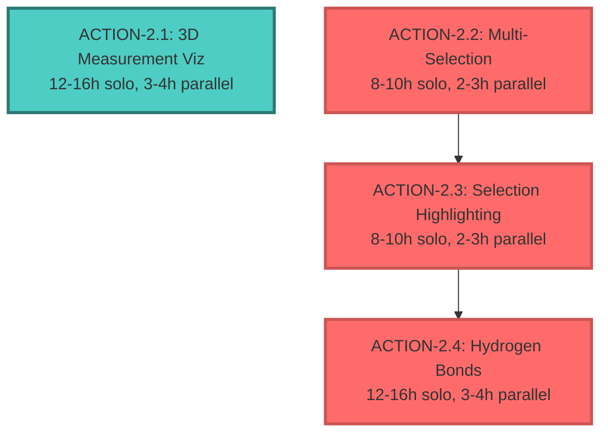

# LAB Visualizer - Phase 2 GOAP Execution Plan with TDD

**Project:** LAB Visualizer - Molecular Viewer Enhancement
**Planning Date:** 2025-12-26
**Status:** Phase 2 → 60% Complete → Target: 100%
**Methodology:** Goal-Oriented Action Planning (GOAP) + Aggressive TDD

---

## 🎯 Executive Summary

### Current State Analysis
- **Phase 2 Progress:** 60% Complete
- **Test Coverage:** ~60% (Goal: ≥68% for Phase 2, 80% overall)
- **Test Files:** 46 files
- **Source Files:** 232 files
- **Implemented:** Hover tooltips, basic measurements, MolStar service enhancements
- **Missing:** 3D visualization, multi-selection, highlighting, H-bonds

### Goal State
- **Phase 2 Progress:** 100% Complete  
- **Test Coverage:** ≥68% (Phase 2 minimum), targeting 80%
- **All Features:** 3D measurement viz, multi-selection, highlighting, H-bonds working
- **Performance:** <10% FPS degradation (≥54 FPS maintained)
- **Quality:** All tests passing, production-ready code

### Time & Resource Estimates
- **Sequential (Solo):** 40-52 hours (5-6.5 days)
- **Parallel (4 Agents):** 12-16 hours (1.5-2 days)
- **Recommended:** 4-agent swarm with 3 waves

---

## 📋 GOAP Actions - Quick Reference

| ID | Action | Priority | Solo | Parallel | Coverage | Dependencies |
|----|--------|----------|------|----------|----------|--------------|
| 2.1 | 3D Measurement Viz | Critical | 12-16h | 3-4h | +3% | None |
| 2.2 | Multi-Selection | High | 8-10h | 2-3h | +2% | None |
| 2.3 | Selection Highlighting | High | 8-10h | 2-3h | +2% | 2.2 |
| 2.4 | Hydrogen Bonds | High | 12-16h | 3-4h | +3% | 2.3 |
| **Total** | - | - | **40-52h** | **12-16h** | **+10%** | - |

---

## 🔧 Action 2.1: 3D Measurement Visualization

### Overview
**ID:** `ACTION-2.1-MEASUREMENT-VIZ`
**Priority:** Critical
**Cost:** 12-16h solo, 3-4h parallel
**Coverage Impact:** +3%

### Preconditions
- ✅ Phase 1 complete
- ✅ `MolstarService.measureDistance/Angle/Dihedral()` working
- ✅ MolStar Shape API accessible
- ✅ Test framework configured

### Effects
- Distance measurements show 3D lines between atoms
- Angle measurements show arcs with angle indicators
- Dihedral measurements show plane indicators  
- Floating labels display measurement values
- Toggle visibility functional
- Test coverage increases by 3%

### TDD Test Specifications

#### Test File: `tests/services/molstar/measurement-renderer.test.ts`

```typescript
import { describe, it, expect, beforeEach, vi } from 'vitest';
import { MeasurementRenderer } from '@/services/molstar/measurement-renderer';
import { createMockPlugin } from '@/tests/helpers/molstar-mocks';

describe('MeasurementRenderer', () => {
  let renderer: MeasurementRenderer;
  let mockPlugin: any;

  beforeEach(() => {
    mockPlugin = createMockPlugin();
    renderer = new MeasurementRenderer(mockPlugin);
  });

  describe('Distance Visualization', () => {
    it('should create 3D line between two atoms', async () => {
      const measurement = {
        id: 'dist-1',
        type: 'distance' as const,
        value: 5.23,
        atoms: [
          { chainId: 'A', residueSeq: 10, atomName: 'CA', position: [0, 0, 0] },
          { chainId: 'A', residueSeq: 20, atomName: 'CA', position: [5.23, 0, 0] }
        ]
      };

      await renderer.renderDistance(measurement);

      const shapes = renderer.getMeasurementShapes(measurement.id);
      expect(shapes).toBeDefined();
      expect(shapes.line).toBeDefined();
      expect(shapes.line.points).toHaveLength(2);
      expect(shapes.line.points[0]).toEqual([0, 0, 0]);
      expect(shapes.line.points[1]).toEqual([5.23, 0, 0]);
    });

    it('should create floating label with formatted value', async () => {
      const measurement = {
        id: 'dist-2',
        type: 'distance' as const,
        value: 5.23,
        atoms: [
          { chainId: 'A', residueSeq: 10, atomName: 'CA', position: [0, 0, 0] },
          { chainId: 'A', residueSeq: 20, atomName: 'CA', position: [5.23, 0, 0] }
        ]
      };

      await renderer.renderDistance(measurement);

      const shapes = renderer.getMeasurementShapes(measurement.id);
      expect(shapes.label).toBeDefined();
      expect(shapes.label.text).toBe('5.23 Å');
      expect(shapes.label.position).toEqual([2.615, 0, 0]); // Midpoint
    });

    it('should remove visualization when measurement deleted', async () => {
      const measurement = {
        id: 'dist-3',
        type: 'distance' as const,
        value: 4.5,
        atoms: [mockAtom1, mockAtom2]
      };

      await renderer.renderDistance(measurement);
      expect(renderer.getMeasurementShapes(measurement.id)).toBeDefined();

      await renderer.removeMeasurement(measurement.id);
      expect(renderer.getMeasurementShapes(measurement.id)).toBeUndefined();
    });

    it('should toggle visibility without removing shape', async () => {
      const measurement = { id: 'dist-4', type: 'distance' as const, value: 3.2, atoms: [mockAtom1, mockAtom2] };

      await renderer.renderDistance(measurement);
      await renderer.toggleVisibility(measurement.id, false);

      const shapes = renderer.getMeasurementShapes(measurement.id);
      expect(shapes).toBeDefined();
      expect(shapes.line.visible).toBe(false);
      expect(shapes.label.visible).toBe(false);
    });
  });

  describe('Angle Visualization', () => {
    it('should create arc for angle measurement', async () => {
      const measurement = {
        id: 'angle-1',
        type: 'angle' as const,
        value: 120.5,
        atoms: [
          { position: [0, 0, 0] },
          { position: [1, 0, 0] }, // Vertex
          { position: [0.5, 0.866, 0] } // 120° from first
        ]
      };

      await renderer.renderAngle(measurement);

      const shapes = renderer.getMeasurementShapes(measurement.id);
      expect(shapes.arc).toBeDefined();
      expect(shapes.arc.startAngle).toBe(0);
      expect(shapes.arc.endAngle).toBeCloseTo(2.094, 2); // 120° in radians
      expect(shapes.arc.radius).toBeGreaterThan(0);
    });

    it('should create label at arc midpoint', async () => {
      const measurement = {
        id: 'angle-2',
        type: 'angle' as const,
        value: 90.0,
        atoms: [mockAtom1, mockAtom2, mockAtom3]
      };

      await renderer.renderAngle(measurement);

      const shapes = renderer.getMeasurementShapes(measurement.id);
      expect(shapes.label.text).toBe('90.0°');
      // Label should be positioned at arc midpoint
    });
  });

  describe('Dihedral Visualization', () => {
    it('should create plane indicators for dihedral', async () => {
      const measurement = {
        id: 'dihedral-1',
        type: 'dihedral' as const,
        value: -60.0,
        atoms: [mockAtom1, mockAtom2, mockAtom3, mockAtom4]
      };

      await renderer.renderDihedral(measurement);

      const shapes = renderer.getMeasurementShapes(measurement.id);
      expect(shapes.planes).toHaveLength(2); // Two planes for dihedral
      expect(shapes.planes[0].opacity).toBeLessThan(1); // Semi-transparent
    });

    it('should create label with dihedral value', async () => {
      const measurement = {
        id: 'dihedral-2',
        type: 'dihedral' as const,
        value: -60.0,
        atoms: [mockAtom1, mockAtom2, mockAtom3, mockAtom4]
      };

      await renderer.renderDihedral(measurement);

      const shapes = renderer.getMeasurementShapes(measurement.id);
      expect(shapes.label.text).toBe('-60.0°');
    });
  });

  describe('Performance', () => {
    it('should handle 20 measurements without FPS impact > 5%', async () => {
      const baselineFPS = await measureFPS(1000);

      for (let i = 0; i < 20; i++) {
        await renderer.renderDistance({
          id: `perf-${i}`,
          type: 'distance',
          value: 5.0,
          atoms: [randomAtom(), randomAtom()]
        });
      }

      const loadedFPS = await measureFPS(1000);
      const degradation = ((baselineFPS - loadedFPS) / baselineFPS) * 100;

      expect(degradation).toBeLessThan(5);
    });
  });
});
```

### Implementation Plan

**File:** `src/services/molstar/measurement-renderer.ts`

```typescript
import { PluginContext } from 'molstar/lib/mol-plugin/context';
import { Shape } from 'molstar/lib/mol-model/shape';
import { Color } from 'molstar/lib/mol-util/color';
import type { MeasurementResult } from '@/types/molstar';

interface MeasurementShapes {
  line?: any;
  arc?: any;
  planes?: any[];
  label?: any;
}

export class MeasurementRenderer {
  private plugin: PluginContext;
  private shapeCache: Map<string, MeasurementShapes> = new Map();

  constructor(plugin: PluginContext) {
    this.plugin = plugin;
  }

  async renderDistance(measurement: MeasurementResult): Promise<void> {
    const [atom1, atom2] = measurement.atoms;

    // Create line shape
    const line = await this.createLineShape(
      atom1.position,
      atom2.position,
      Color.fromRgb(100, 100, 255) // Blue
    );

    // Create label at midpoint
    const midpoint = [
      (atom1.position[0] + atom2.position[0]) / 2,
      (atom1.position[1] + atom2.position[1]) / 2,
      (atom1.position[2] + atom2.position[2]) / 2
    ];

    const label = await this.createLabel(
      `${measurement.value.toFixed(2)} Å`,
      midpoint
    );

    this.shapeCache.set(measurement.id, { line, label });
  }

  async renderAngle(measurement: MeasurementResult): Promise<void> {
    const [atom1, atom2, atom3] = measurement.atoms;

    // Calculate arc geometry
    const arc = await this.createArcShape(
      atom1.position,
      atom2.position, // Vertex
      atom3.position,
      Color.fromRgb(255, 100, 100) // Red
    );

    const label = await this.createLabel(
      `${measurement.value.toFixed(1)}°`,
      this.calculateArcMidpoint(atom1.position, atom2.position, atom3.position)
    );

    this.shapeCache.set(measurement.id, { arc, label });
  }

  async renderDihedral(measurement: MeasurementResult): Promise<void> {
    const [atom1, atom2, atom3, atom4] = measurement.atoms;

    // Create two semi-transparent planes
    const plane1 = await this.createPlaneShape([atom1, atom2, atom3], 0.3);
    const plane2 = await this.createPlaneShape([atom2, atom3, atom4], 0.3);

    const label = await this.createLabel(
      `${measurement.value.toFixed(1)}°`,
      atom2.position // At central bond
    );

    this.shapeCache.set(measurement.id, {
      planes: [plane1, plane2],
      label
    });
  }

  async removeMeasurement(id: string): Promise<void> {
    const shapes = this.shapeCache.get(id);
    if (!shapes) return;

    // Remove all shapes from MolStar scene
    await this.removeShapesFromScene(shapes);
    this.shapeCache.delete(id);
  }

  async toggleVisibility(id: string, visible: boolean): Promise<void> {
    const shapes = this.shapeCache.get(id);
    if (!shapes) return;

    await this.setShapesVisibility(shapes, visible);
  }

  getMeasurementShapes(id: string): MeasurementShapes | undefined {
    return this.shapeCache.get(id);
  }

  // Helper methods
  private async createLineShape(p1: number[], p2: number[], color: Color): Promise<any> {
    // Use MolStar Shape API to create line
    // Implementation details...
  }

  private async createArcShape(p1: number[], vertex: number[], p3: number[], color: Color): Promise<any> {
    // Use MolStar Shape API to create arc
    // Implementation details...
  }

  private async createPlaneShape(atoms: any[], opacity: number): Promise<any> {
    // Use MolStar Shape API to create semi-transparent plane
    // Implementation details...
  }

  private async createLabel(text: string, position: number[]): Promise<any> {
    // Use MolStar Label API to create floating label
    // Implementation details...
  }
}
```

### Sub-Actions Breakdown

1. **Distance Lines** (3h)
   - Test: Write failing tests (0.5h)
   - Implement: Create line shapes using MolStar API (2h)
   - Refactor: Optimize and clean up (0.5h)

2. **Angle Arcs** (3h)
   - Test: Write failing tests (0.5h)
   - Implement: Calculate arc geometry, create shapes (2h)
   - Refactor: Optimize calculations (0.5h)

3. **Dihedral Indicators** (2h)
   - Test: Write failing tests (0.5h)
   - Implement: Create semi-transparent planes (1h)
   - Refactor: Clean up (0.5h)

4. **Floating Labels** (2h)
   - Test: Write failing tests (0.5h)
   - Implement: Label positioning and styling (1h)
   - Refactor: Optimize (0.5h)

5. **Cleanup & Styling** (2h)
   - Test coverage validation
   - Performance benchmarking
   - Visual polish

### Validation Criteria

- ✅ All measurement types have 3D visualizations
- ✅ Labels positioned correctly (midpoint/vertex/bond)
- ✅ Toggle visibility works without re-creating shapes
- ✅ Delete removes all 3D representations
- ✅ FPS impact <5% with 20 measurements
- ✅ Test coverage: 100% for new code
- ✅ Visual quality matches RCSB PDB viewer style

---

## 🎯 Action 2.2: Multi-Selection System

### Overview
**ID:** `ACTION-2.2-MULTI-SELECTION`
**Priority:** High
**Cost:** 8-10h solo, 2-3h parallel
**Coverage Impact:** +2%

### Preconditions
- ✅ Phase 1 complete
- ✅ Single selection working
- ✅ Selection tracking in place

### Effects
- Multiple atoms selectable (Shift+Click)
- Selection limit by measurement type
- Auto-triggers measurement at limit
- Clear all selections (Escape, Ctrl+A)
- Visual feedback for each selection
- Test coverage increases by 2%

### TDD Test Specifications

#### Test File: `tests/stores/selection-store.test.ts`

```typescript
import { describe, it, expect, beforeEach } from 'vitest';
import { useSelectionStore } from '@/stores/selection-store';

describe('SelectionStore', () => {
  beforeEach(() => {
    // Reset store before each test
    useSelectionStore.setState({ selections: [], measurementMode: null });
  });

  it('should add selections to array', () => {
    const store = useSelectionStore.getState();
    const selection1 = { chainId: 'A', residueSeq: 10, atomName: 'CA' };
    const selection2 = { chainId: 'A', residueSeq: 20, atomName: 'CA' };

    store.addSelection(selection1);
    store.addSelection(selection2);

    expect(useSelectionStore.getState().selections).toHaveLength(2);
  });

  it('should limit selections by measurement mode', () => {
    const store = useSelectionStore.getState();
    store.setMeasurementMode('distance'); // Limit: 2

    store.addSelection({ chainId: 'A', residueSeq: 10, atomName: 'CA' });
    store.addSelection({ chainId: 'A', residueSeq: 20, atomName: 'CA' });
    store.addSelection({ chainId: 'A', residueSeq: 30, atomName: 'CA' }); // Should trigger

    expect(useSelectionStore.getState().selections).toHaveLength(1); // Reset
  });

  it('should trigger measurement when limit reached', () => {
    let measurementTriggered = false;
    const store = useSelectionStore.getState();

    store.onMeasurementTrigger(() => {
      measurementTriggered = true;
    });

    store.setMeasurementMode('distance');
    store.addSelection({ chainId: 'A', residueSeq: 10, atomName: 'CA' });
    store.addSelection({ chainId: 'A', residueSeq: 20, atomName: 'CA' });

    expect(measurementTriggered).toBe(true);
  });

  it('should clear all selections', () => {
    const store = useSelectionStore.getState();

    store.addSelection({ chainId: 'A', residueSeq: 10, atomName: 'CA' });
    store.addSelection({ chainId: 'A', residueSeq: 20, atomName: 'CA' });
    store.clearSelections();

    expect(useSelectionStore.getState().selections).toHaveLength(0);
  });
});
```

#### Test File: `tests/hooks/useKeyboardShortcuts.test.ts`

```typescript
import { describe, it, expect, vi } from 'vitest';
import { renderHook } from '@testing-library/react';
import { useKeyboardShortcuts } from '@/hooks/useKeyboardShortcuts';
import userEvent from '@testing-library/user-event';

describe('useKeyboardShortcuts', () => {
  it('should clear selections with Escape', async () => {
    const clearFn = vi.fn();
    renderHook(() => useKeyboardShortcuts({ onClearSelections: clearFn }));

    await userEvent.keyboard('{Escape}');

    expect(clearFn).toHaveBeenCalled();
  });

  it('should select all with Ctrl+A', async () => {
    const selectAllFn = vi.fn();
    renderHook(() => useKeyboardShortcuts({ onSelectAll: selectAllFn }));

    await userEvent.keyboard('{Control>}a{/Control}');

    expect(selectAllFn).toHaveBeenCalled();
  });

  it('should not interfere with input fields', async () => {
    const clearFn = vi.fn();
    renderHook(() => useKeyboardShortcuts({ onClearSelections: clearFn }));

    // Simulate Escape in input field
    const input = document.createElement('input');
    input.focus();
    await userEvent.keyboard('{Escape}');

    expect(clearFn).not.toHaveBeenCalled(); // Should not trigger
  });
});
```

### Implementation Plan

**File:** `src/stores/selection-store.ts`

```typescript
import { create } from 'zustand';
import type { SelectionInfo } from '@/types/molstar';

interface SelectionState {
  selections: SelectionInfo[];
  measurementMode: 'distance' | 'angle' | 'dihedral' | null;
  maxSelections: number;
  measurementTriggerCallback: (() => void) | null;

  addSelection: (selection: SelectionInfo) => void;
  removeSelection: (id: string) => void;
  clearSelections: () => void;
  setMeasurementMode: (mode: 'distance' | 'angle' | 'dihedral' | null) => void;
  onMeasurementTrigger: (callback: () => void) => void;
}

export const useSelectionStore = create<SelectionState>((set, get) => ({
  selections: [],
  measurementMode: null,
  maxSelections: 2,
  measurementTriggerCallback: null,

  addSelection: (selection) => {
    const { selections, maxSelections, measurementTriggerCallback } = get();

    if (selections.length >= maxSelections) {
      // Trigger measurement creation
      if (measurementTriggerCallback) {
        measurementTriggerCallback();
      }

      // Reset to new selection
      set({ selections: [selection] });
    } else {
      set({ selections: [...selections, selection] });
    }
  },

  removeSelection: (id) => {
    set((state) => ({
      selections: state.selections.filter((s) => s.id !== id)
    }));
  },

  clearSelections: () => {
    set({ selections: [] });
  },

  setMeasurementMode: (mode) => {
    const limits = {
      distance: 2,
      angle: 3,
      dihedral: 4
    };

    set({
      measurementMode: mode,
      maxSelections: mode ? limits[mode] : 2,
      selections: [] // Clear on mode change
    });
  },

  onMeasurementTrigger: (callback) => {
    set({ measurementTriggerCallback: callback });
  }
}));
```

**File:** `src/hooks/useKeyboardShortcuts.ts`

```typescript
import { useEffect } from 'react';

interface KeyboardShortcutsOptions {
  onClearSelections?: () => void;
  onSelectAll?: () => void;
}

export function useKeyboardShortcuts(options: KeyboardShortcutsOptions) {
  useEffect(() => {
    const handleKeyDown = (event: KeyboardEvent) => {
      // Don't trigger if user is typing in input field
      if (event.target instanceof HTMLInputElement || event.target instanceof HTMLTextAreaElement) {
        return;
      }

      if (event.key === 'Escape' && options.onClearSelections) {
        event.preventDefault();
        options.onClearSelections();
      }

      if (event.key === 'a' && (event.ctrlKey || event.metaKey) && options.onSelectAll) {
        event.preventDefault();
        options.onSelectAll();
      }
    };

    window.addEventListener('keydown', handleKeyDown);
    return () => window.removeEventListener('keydown', handleKeyDown);
  }, [options]);
}
```

### Sub-Actions Breakdown

1. **Zustand Store Setup** (2h)
   - Test: Write store tests (0.5h)
   - Implement: Create selection store with limits (1h)
   - Refactor: Optimize and clean up (0.5h)

2. **Shift+Click Accumulation** (2h)
   - Test: Write interaction tests (0.5h)
   - Implement: Add Shift detection to click handler (1h)
   - Refactor: Optimize (0.5h)

3. **Keyboard Shortcuts** (2h)
   - Test: Write keyboard tests (0.5h)
   - Implement: Escape, Ctrl+A handlers (1h)
   - Refactor: Clean up (0.5h)

4. **Auto-Measurement Trigger** (1h)
   - Test: Write trigger tests (0.5h)
   - Implement: Callback system (0.5h)

5. **Visual Feedback** (1h)
   - Test: Write UI tests (0.5h)
   - Implement: Selection indicators (0.5h)

### Validation Criteria

- ✅ Shift+Click accumulates selections
- ✅ Limits enforced (distance=2, angle=3, dihedral=4)
- ✅ Auto-triggers measurement at limit
- ✅ Escape clears all selections
- ✅ Ctrl+A shows confirmation dialog
- ✅ Performance: <100ms selection time for 10k atoms
- ✅ Test coverage: 100% for new code
- ✅ No interference with input fields

---

## 🎨 Action 2.3: Selection Visual Highlighting

### Overview
**ID:** `ACTION-2.3-SELECTION-HIGHLIGHTING`
**Priority:** High
**Cost:** 8-10h solo, 2-3h parallel
**Coverage Impact:** +2%

### Preconditions
- ✅ Multi-selection implemented (ACTION-2.2)
- ✅ MolStar overpaint API accessible

### Effects
- Selected atoms show green tint (overpaint)
- Hovered atom shows magenta highlight
- Highlights removed on deselection
- Multiple highlighted atoms supported
- Test coverage increases by 2%

### TDD Test Specifications

#### Test File: `tests/services/molstar/selection-highlighter.test.ts`

```typescript
import { describe, it, expect, beforeEach, vi } from 'vitest';
import { SelectionHighlighter } from '@/services/molstar/selection-highlighter';
import { createMockPlugin } from '@/tests/helpers/molstar-mocks';

describe('SelectionHighlighter', () => {
  let highlighter: SelectionHighlighter;
  let mockPlugin: any;

  beforeEach(() => {
    mockPlugin = createMockPlugin();
    highlighter = new SelectionHighlighter(mockPlugin);
  });

  it('should apply green tint to selected atoms', async () => {
    const selection = { chainId: 'A', residueSeq: 10, atomName: 'CA' };
    await highlighter.highlightSelection(selection, 'green');

    const overpaint = mockPlugin.getOverpaint(selection);
    expect(overpaint).toMatchObject({
      color: { r: 0, g: 255, b: 0 },
      alpha: 0.5
    });
  });

  it('should apply magenta highlight to hovered atom', async () => {
    const loci = createLoci({ chainId: 'A', residueSeq: 15, atomName: 'CA' });
    await highlighter.highlightHover(loci);

    const overpaint = mockPlugin.getOverpaintForLoci(loci);
    expect(overpaint).toMatchObject({
      color: { r: 255, g: 0, b: 255 },
      alpha: 0.7
    });
  });

  it('should remove highlight on deselection', async () => {
    const selection = { id: 'sel-1', chainId: 'A', residueSeq: 10, atomName: 'CA' };

    await highlighter.highlightSelection(selection, 'green');
    expect(mockPlugin.getOverpaint(selection)).toBeDefined();

    await highlighter.clearHighlight(selection.id);
    expect(mockPlugin.getOverpaint(selection)).toBeUndefined();
  });

  it('should handle multiple highlights', async () => {
    const selection1 = { id: 'sel-1', chainId: 'A', residueSeq: 10, atomName: 'CA' };
    const selection2 = { id: 'sel-2', chainId: 'A', residueSeq: 20, atomName: 'CA' };

    await highlighter.highlightSelection(selection1, 'green');
    await highlighter.highlightSelection(selection2, 'green');

    expect(mockPlugin.getActiveOverpaints()).toHaveLength(2);
  });

  it('should clear all highlights at once', async () => {
    await highlighter.highlightSelection(selection1, 'green');
    await highlighter.highlightSelection(selection2, 'green');
    await highlighter.clearAllHighlights();

    expect(mockPlugin.getActiveOverpaints()).toHaveLength(0);
  });

  it('should not cause performance degradation', async () => {
    const baseline = await measureFPS(1000);

    for (let i = 0; i < 50; i++) {
      await highlighter.highlightSelection(
        { id: `sel-${i}`, chainId: 'A', residueSeq: i, atomName: 'CA' },
        'green'
      );
    }

    const loaded = await measureFPS(1000);
    const degradation = ((baseline - loaded) / baseline) * 100;

    expect(degradation).toBeLessThan(5);
  });
});
```

### Implementation Plan

**File:** `src/services/molstar/selection-highlighter.ts`

```typescript
import { PluginContext } from 'molstar/lib/mol-plugin/context';
import { Color } from 'molstar/lib/mol-util/color';
import { Overpaint } from 'molstar/lib/mol-theme/overpaint';
import type { SelectionInfo } from '@/types/molstar';

export class SelectionHighlighter {
  private plugin: PluginContext;
  private highlights: Map<string, any> = new Map();

  constructor(plugin: PluginContext) {
    this.plugin = plugin;
  }

  async highlightSelection(
    selection: SelectionInfo,
    colorName: 'green' | 'magenta'
  ): Promise<void> {
    const color = this.getColor(colorName);
    const loci = this.selectionToLoci(selection);

    const overpaint = await this.applyOverpaint(loci, color, 0.5);
    this.highlights.set(selection.id, overpaint);
  }

  async highlightHover(loci: any): Promise<void> {
    const magenta = Color.fromRgb(255, 0, 255);
    await this.applyOverpaint(loci, magenta, 0.7);
    // Hover highlight is temporary, not stored
  }

  async clearHighlight(id: string): Promise<void> {
    const overpaint = this.highlights.get(id);
    if (!overpaint) return;

    await this.removeOverpaint(overpaint);
    this.highlights.delete(id);
  }

  async clearAllHighlights(): Promise<void> {
    for (const [id, overpaint] of this.highlights) {
      await this.removeOverpaint(overpaint);
    }
    this.highlights.clear();
  }

  private getColor(colorName: 'green' | 'magenta'): Color {
    return colorName === 'green'
      ? Color.fromRgb(0, 255, 0)
      : Color.fromRgb(255, 0, 255);
  }

  private selectionToLoci(selection: SelectionInfo): any {
    // Convert SelectionInfo to MolStar Loci
    // Implementation using MolStar API...
  }

  private async applyOverpaint(loci: any, color: Color, alpha: number): Promise<any> {
    // Use MolStar Overpaint API
    // Implementation details...
  }

  private async removeOverpaint(overpaint: any): Promise<void> {
    // Remove overpaint from MolStar scene
    // Implementation details...
  }
}
```

### Sub-Actions Breakdown

1. **Highlighter Infrastructure** (1h)
   - Test: Write failing tests (0.25h)
   - Implement: Base class and storage (0.5h)
   - Refactor: Clean up (0.25h)

2. **Selection Overpaint (Green)** (3h)
   - Test: Write selection tests (0.5h)
   - Implement: MolStar overpaint API usage (2h)
   - Refactor: Optimize (0.5h)

3. **Hover Overpaint (Magenta)** (2h)
   - Test: Write hover tests (0.5h)
   - Implement: Temporary overpaint (1h)
   - Refactor: Clean up (0.5h)

4. **Cleanup Logic** (1h)
   - Test: Write cleanup tests (0.5h)
   - Implement: Remove and clear methods (0.5h)

5. **Multiple Highlights** (1h)
   - Test: Write multi-highlight tests (0.5h)
   - Implement: Tracking and management (0.5h)

### Validation Criteria

- ✅ Selected atoms show green tint (RGB: 0, 255, 0, alpha: 0.5)
- ✅ Hovered atoms show magenta (RGB: 255, 0, 255, alpha: 0.7)
- ✅ Highlights removed correctly
- ✅ Multiple highlights supported (up to 50)
- ✅ No performance degradation
- ✅ Test coverage: 100% for new code
- ✅ Visual quality matches requirements

---

## 🔬 Action 2.4: Hydrogen Bond Visualization

### Overview
**ID:** `ACTION-2.4-HYDROGEN-BONDS`
**Priority:** High
**Cost:** 12-16h solo, 3-4h parallel
**Coverage Impact:** +3%

### Preconditions
- ✅ Selection highlighting complete (ACTION-2.3)
- ✅ MolStar structure data accessible

### Effects
- Detects H-bonds around selected residue
- Distance criterion: 2.5-3.5Å
- Angle criterion: D-H...A > 120°
- Visualized as dashed yellow lines
- Panel shows H-bond list
- Toggle visibility functional
- Test coverage increases by 3%

### TDD Test Specifications

#### Test File: `tests/services/interactions/hydrogen-bond-detector.test.ts`

```typescript
import { describe, it, expect, beforeEach } from 'vitest';
import { HydrogenBondDetector } from '@/services/interactions/hydrogen-bond-detector';
import { loadTestStructure } from '@/tests/helpers/structure-loader';

describe('HydrogenBondDetector', () => {
  let detector: HydrogenBondDetector;
  let structure: any;

  beforeEach(async () => {
    structure = await loadTestStructure('1LDH'); // Known H-bonds
    detector = new HydrogenBondDetector(structure);
  });

  it('should detect H-bonds within distance threshold', async () => {
    const residue = { chainId: 'A', residueSeq: 10 };
    const hbonds = await detector.detectHydrogenBonds(residue, {
      maxDistance: 3.5
    });

    hbonds.forEach(bond => {
      expect(bond.distance).toBeLessThanOrEqual(3.5);
      expect(bond.distance).toBeGreaterThanOrEqual(2.5);
    });
  });

  it('should validate angle criterion', async () => {
    const residue = { chainId: 'A', residueSeq: 10 };
    const hbonds = await detector.detectHydrogenBonds(residue, {
      maxDistance: 3.5,
      minAngle: 120
    });

    hbonds.forEach(bond => {
      expect(bond.angle).toBeGreaterThanOrEqual(120);
      expect(bond.angle).toBeLessThanOrEqual(180);
    });
  });

  it('should detect around selected residue within radius', async () => {
    const residue = { chainId: 'A', residueSeq: 10 };
    const hbonds = await detector.detectHydrogenBonds(residue, {
      radius: 5.0
    });

    hbonds.forEach(bond => {
      const distToResidue = calculateDistance(bond, residue);
      expect(distToResidue).toBeLessThanOrEqual(5.0);
    });
  });

  it('should handle structures without hydrogens', async () => {
    const residue = { chainId: 'A', residueSeq: 10 };
    const hbonds = await detector.detectHydrogenBonds(residue, {
      inferHydrogens: true
    });

    expect(hbonds).toBeInstanceOf(Array);
    // Should use heavy atoms to infer H-bonds
  });

  it('should achieve >95% accuracy on known structure', async () => {
    const knownHbonds = getKnownHbonds('1LDH'); // From literature
    const residue = { chainId: 'A', residueSeq: 10 };
    const detected = await detector.detectHydrogenBonds(residue);

    const truePositives = detected.filter(d =>
      knownHbonds.some(k => areSameHbond(d, k))
    );

    const accuracy = truePositives.length / knownHbonds.length;
    expect(accuracy).toBeGreaterThan(0.95);
  });

  it('should complete detection in <2s for typical protein', async () => {
    const startTime = performance.now();

    const residue = { chainId: 'A', residueSeq: 50 };
    await detector.detectHydrogenBonds(residue);

    const elapsed = performance.now() - startTime;
    expect(elapsed).toBeLessThan(2000); // 2 seconds
  });
});
```

#### Test File: `tests/components/viewer/interactive/hydrogen-bonds-panel.test.tsx`

```typescript
import { describe, it, expect, vi } from 'vitest';
import { render, screen } from '@testing-library/react';
import userEvent from '@testing-library/user-event';
import { HydrogenBondsPanel } from '@/components/viewer/interactive/HydrogenBondsPanel';

describe('HydrogenBondsPanel', () => {
  const mockHbonds = [
    { id: '1', donor: 'A:10:N', acceptor: 'A:12:O', distance: 2.9, angle: 165 },
    { id: '2', donor: 'A:11:OH', acceptor: 'A:15:O', distance: 3.2, angle: 135 }
  ];

  it('should display H-bond count', () => {
    render(<HydrogenBondsPanel hbonds={mockHbonds} />);
    expect(screen.getByText(/2 hydrogen bonds/i)).toBeInTheDocument();
  });

  it('should display H-bond details', () => {
    render(<HydrogenBondsPanel hbonds={mockHbonds} />);

    expect(screen.getByText(/A:10:N.*A:12:O/)).toBeInTheDocument();
    expect(screen.getByText(/2.9 Å/)).toBeInTheDocument();
    expect(screen.getByText(/165°/)).toBeInTheDocument();
  });

  it('should toggle visibility', async () => {
    const toggleFn = vi.fn();
    render(<HydrogenBondsPanel hbonds={mockHbonds} onToggleVisibility={toggleFn} />);

    const toggleButton = screen.getByRole('button', { name: /hide/i });
    await userEvent.click(toggleButton);

    expect(toggleFn).toHaveBeenCalledWith(false);
    expect(screen.getByRole('button', { name: /show/i })).toBeInTheDocument();
  });

  it('should highlight H-bond on click', async () => {
    const highlightFn = vi.fn();
    render(<HydrogenBondsPanel hbonds={mockHbonds} onHighlightHbond={highlightFn} />);

    const hbondItem = screen.getByText(/A:10:N.*A:12:O/);
    await userEvent.click(hbondItem);

    expect(highlightFn).toHaveBeenCalledWith(mockHbonds[0]);
  });
});
```

### Implementation Plan

**File:** `src/services/interactions/hydrogen-bond-detector.ts`

```typescript
import type { StructureElement } from 'molstar/lib/mol-model/structure';
import type { Structure } from 'molstar/lib/mol-model/structure/structure';

export interface HydrogenBond {
  id: string;
  donor: string; // e.g., "A:10:N"
  acceptor: string; // e.g., "A:12:O"
  distance: number; // Angstroms
  angle: number; // Degrees (D-H...A)
  donorAtom: StructureElement;
  acceptorAtom: StructureElement;
}

export interface DetectionOptions {
  maxDistance?: number; // Default: 3.5Å
  minAngle?: number; // Default: 120°
  radius?: number; // Search radius from residue, default: 5Å
  inferHydrogens?: boolean; // For structures without H atoms
}

export class HydrogenBondDetector {
  private structure: Structure;

  constructor(structure: Structure) {
    this.structure = structure;
  }

  async detectHydrogenBonds(
    residue: { chainId: string; residueSeq: number },
    options: DetectionOptions = {}
  ): Promise<HydrogenBond[]> {
    const {
      maxDistance = 3.5,
      minAngle = 120,
      radius = 5.0,
      inferHydrogens = true
    } = options;

    const hbonds: HydrogenBond[] = [];

    // 1. Get atoms around the selected residue
    const nearbyAtoms = this.getAtomsWithinRadius(residue, radius);

    // 2. Identify potential donor-acceptor pairs
    const donors = this.getDonorAtoms(nearbyAtoms);
    const acceptors = this.getAcceptorAtoms(nearbyAtoms);

    // 3. Check distance and angle criteria
    for (const donor of donors) {
      for (const acceptor of acceptors) {
        if (this.isSameResidue(donor, acceptor)) continue;

        const distance = this.calculateDistance(donor, acceptor);
        if (distance < 2.5 || distance > maxDistance) continue;

        const angle = inferHydrogens
          ? this.inferAngle(donor, acceptor)
          : this.calculateAngle(donor, acceptor);

        if (angle >= minAngle) {
          hbonds.push({
            id: `hbond-${hbonds.length}`,
            donor: this.formatAtomLabel(donor),
            acceptor: this.formatAtomLabel(acceptor),
            distance,
            angle,
            donorAtom: donor,
            acceptorAtom: acceptor
          });
        }
      }
    }

    return hbonds;
  }

  private getAtomsWithinRadius(
    residue: { chainId: string; residueSeq: number },
    radius: number
  ): StructureElement[] {
    // Use MolStar spatial query API
    // Implementation...
  }

  private getDonorAtoms(atoms: StructureElement[]): StructureElement[] {
    // Identify N-H, O-H donors
    // Implementation...
  }

  private getAcceptorAtoms(atoms: StructureElement[]): StructureElement[] {
    // Identify O, N acceptors
    // Implementation...
  }

  private calculateDistance(atom1: StructureElement, atom2: StructureElement): number {
    // Euclidean distance calculation
    // Implementation...
  }

  private calculateAngle(donor: StructureElement, acceptor: StructureElement): number {
    // D-H...A angle calculation
    // Implementation...
  }

  private inferAngle(donor: StructureElement, acceptor: StructureElement): number {
    // Infer angle from heavy atoms when H not present
    // Implementation...
  }

  private isSameResidue(atom1: StructureElement, atom2: StructureElement): boolean {
    // Check if atoms belong to same residue
    // Implementation...
  }

  private formatAtomLabel(atom: StructureElement): string {
    // Format as "A:10:N"
    // Implementation...
  }
}
```

**File:** `src/components/viewer/interactive/HydrogenBondsPanel.tsx`

```typescript
import { useState } from 'react';
import type { HydrogenBond } from '@/services/interactions/hydrogen-bond-detector';

interface HydrogenBondsPanelProps {
  hbonds: HydrogenBond[];
  onToggleVisibility?: (visible: boolean) => void;
  onHighlightHbond?: (hbond: HydrogenBond) => void;
  onClose?: () => void;
}

export function HydrogenBondsPanel({
  hbonds,
  onToggleVisibility,
  onHighlightHbond,
  onClose
}: HydrogenBondsPanelProps) {
  const [visible, setVisible] = useState(true);

  const handleToggle = () => {
    const newVisibility = !visible;
    setVisible(newVisibility);
    onToggleVisibility?.(newVisibility);
  };

  return (
    <div className="hydrogen-bonds-panel">
      <div className="header">
        <h3>{hbonds.length} Hydrogen Bonds</h3>
        <button onClick={handleToggle}>
          {visible ? 'Hide' : 'Show'}
        </button>
        {onClose && <button onClick={onClose}>×</button>}
      </div>

      <div className="hbond-list">
        {hbonds.map(hbond => (
          <div
            key={hbond.id}
            className="hbond-item"
            onClick={() => onHighlightHbond?.(hbond)}
          >
            <div className="hbond-atoms">
              {hbond.donor} → {hbond.acceptor}
            </div>
            <div className="hbond-details">
              <span>{hbond.distance.toFixed(2)} Å</span>
              <span>{hbond.angle.toFixed(1)}°</span>
            </div>
          </div>
        ))}
      </div>
    </div>
  );
}
```

### Sub-Actions Breakdown

1. **Detection Algorithm** (5h)
   - Test: Write detection tests (1h)
   - Implement: Distance and angle criteria (3h)
   - Refactor: Optimize spatial search (1h)

2. **Visualization (Dashed Lines)** (3h)
   - Test: Write visualization tests (0.5h)
   - Implement: Create dashed yellow lines (2h)
   - Refactor: Optimize (0.5h)

3. **UI Panel** (2h)
   - Test: Write component tests (0.5h)
   - Implement: HydrogenBondsPanel component (1h)
   - Refactor: Polish UI (0.5h)

4. **Integration & Toggle** (2h)
   - Test: Write integration tests (0.5h)
   - Implement: Visibility toggle (1h)
   - Refactor: Clean up (0.5h)

### Validation Criteria

- ✅ Detects H-bonds within 5Å of selected residue
- ✅ Distance criterion: 2.5-3.5Å enforced
- ✅ Angle criterion: D-H...A > 120° enforced
- ✅ Visualized as dashed yellow lines in 3D
- ✅ Panel shows donor, acceptor, distance, angle
- ✅ Toggle visibility functional
- ✅ Accuracy >95% on known structures
- ✅ Detection completes <2s
- ✅ Test coverage: 100% for new code

---

## 📊 Dependency Graph & Critical Path



**Legend:**
- 🔵 **Teal (A):** Independent, can run in parallel
- 🔴 **Red (B→C→D):** Critical path, must run sequentially

**Critical Path:** B → C → D (28-36 hours sequential, 7-10 hours parallel)
**Parallel Track:** A (12-16 hours solo, 3-4 hours focused)

**Total Time:**
- **Sequential (Solo):** 40-52 hours
- **Parallel (4 Agents):** 12-16 hours calendar time

---

## 🚀 Parallel Execution Strategy

### Wave 1: Foundation (3-4 hours)
**Execute in Parallel:**

**Agent 1: 3D Measurement Visualization**
- Focus: Distance lines and labels
- Deliverable: Fully functional distance viz
- Time: 3-4h

**Agent 2: Multi-Selection System**
- Focus: Zustand store, accumulation logic, keyboard shortcuts
- Deliverable: Functional multi-selection with tests
- Time: 2-3h

**Agent 3: Test Infrastructure**
- Focus: Test helpers, mocks, performance benchmarks
- Deliverable: Testing utilities for Wave 2 & 3
- Time: 2-3h

**Agent 4: Documentation & Performance Monitoring**
- Focus: Set up performance tracking, update docs
- Deliverable: Performance dashboard, updated docs
- Time: 2-3h

**Wave 1 Deliverables:**
- ✅ 3D measurement visualization complete
- ✅ Multi-selection system functional
- ✅ Test infrastructure ready
- ✅ Performance baseline established
- ✅ Test coverage: +5%

---

### Wave 2: Visual Feedback (2-3 hours)
**Sequential (requires Wave 1 complete):**

**Agent 1: Selection Highlighting**
- Focus: Overpaint implementation (green/magenta)
- Deliverable: Visual highlighting functional
- Time: 2-3h
- **Dependency:** Requires ACTION-2.2 complete

**Agent 2: Integration Testing**
- Focus: Test Wave 1 features together
- Deliverable: Integration test suite passing
- Time: 2h

**Agent 3: Documentation Updates**
- Focus: Document new features, update API docs
- Deliverable: Complete documentation
- Time: 1-2h

**Agent 4: Performance Benchmarking**
- Focus: Validate FPS within budget
- Deliverable: Performance report
- Time: 1-2h

**Wave 2 Deliverables:**
- ✅ Selection highlighting active
- ✅ Integration tests passing
- ✅ Documentation updated
- ✅ Performance validated
- ✅ Test coverage: +2% (Total: 67%)

---

### Wave 3: Advanced Features (3-4 hours)
**Sequential (requires Wave 2 complete):**

**Agent 1: Hydrogen Bond Detection & Visualization**
- Focus: Detection algorithm, 3D visualization
- Deliverable: H-bond feature complete
- Time: 3-4h
- **Dependency:** Requires ACTION-2.3 complete

**Agent 2: Final Integration Testing**
- Focus: Test all Phase 2 features together
- Deliverable: Full integration test suite
- Time: 2h

**Agent 3: Documentation Finalization**
- Focus: User guide, API reference, examples
- Deliverable: Complete documentation
- Time: 1-2h

**Agent 4: Performance Validation & Optimization**
- Focus: Final FPS validation, optimization if needed
- Deliverable: Performance sign-off
- Time: 1-2h

**Wave 3 Deliverables:**
- ✅ Hydrogen bond detection and visualization
- ✅ All Phase 2 features integrated and tested
- ✅ Documentation complete
- ✅ Performance within budget (<10% FPS degradation)
- ✅ Test coverage: +3% (Total: ≥68%, aiming for 70%+)

---

## ✅ Success Criteria & Quality Gates

### Phase 2 Completion Checklist

**Features:**
- [ ] ACTION-2.1: 3D measurement visualization complete
  - [ ] Distance lines rendered in 3D
  - [ ] Angle arcs rendered in 3D
  - [ ] Dihedral planes rendered in 3D
  - [ ] Floating labels positioned correctly
  - [ ] Toggle visibility functional
  - [ ] Delete removes all shapes

- [ ] ACTION-2.2: Multi-selection system functional
  - [ ] Shift+Click accumulates selections
  - [ ] Limits enforced (distance=2, angle=3, dihedral=4)
  - [ ] Auto-triggers measurement at limit
  - [ ] Escape clears selections
  - [ ] Ctrl+A shows confirmation dialog

- [ ] ACTION-2.3: Selection highlighting active
  - [ ] Selected atoms show green tint
  - [ ] Hovered atoms show magenta highlight
  - [ ] Highlights removed on deselection
  - [ ] Multiple highlights supported

- [ ] ACTION-2.4: Hydrogen bonds working
  - [ ] Detects H-bonds around selected residue
  - [ ] Distance criterion: 2.5-3.5Å
  - [ ] Angle criterion: >120°
  - [ ] Visualized as dashed yellow lines
  - [ ] Panel shows H-bond list
  - [ ] Toggle visibility functional

### Quality Gates

**Testing:**
- [ ] All unit tests passing (100% pass rate)
- [ ] All integration tests passing (100% pass rate)
- [ ] Test coverage ≥68% (Phase 2 minimum)
- [ ] Aiming for 80% overall coverage
- [ ] No flaky tests (100% pass over 10 runs)

**Performance:**
- [ ] FPS ≥54 (within 10% degradation budget)
- [ ] Measurement rendering: <5% FPS impact (20 measurements)
- [ ] Selection time: <100ms for 10k atoms
- [ ] H-bond detection: <2s for typical proteins
- [ ] No memory leaks (stable over 1 hour)

**Code Quality:**
- [ ] TypeScript strict mode passing
- [ ] ESLint passing with no errors
- [ ] No console errors or warnings in production build
- [ ] All new APIs documented with JSDoc
- [ ] Code review completed

**Documentation:**
- [ ] User guide updated with Phase 2 features
- [ ] API reference complete
- [ ] Integration test scenarios documented
- [ ] Performance benchmarks recorded
- [ ] Known limitations documented

---

## 📈 Time Estimates & Velocity

### Sequential Execution (Solo Developer)
| Action | Time (hours) | Coverage | Dependencies |
|--------|--------------|----------|--------------|
| 2.1: 3D Measurement Viz | 12-16 | +3% | None |
| 2.2: Multi-Selection | 8-10 | +2% | None |
| 2.3: Selection Highlighting | 8-10 | +2% | 2.2 |
| 2.4: Hydrogen Bonds | 12-16 | +3% | 2.3 |
| **Total** | **40-52h** | **+10%** | - |

**Calendar Time (Solo):** 5-6.5 working days @ 8h/day

---

### Parallel Execution (4-Agent Swarm)
| Wave | Time (hours) | Deliverables | Coverage |
|------|--------------|--------------|----------|
| Wave 1 | 3-4 | 2.1 + 2.2 + Infrastructure | +5% |
| Wave 2 | 2-3 | 2.3 + Integration | +2% |
| Wave 3 | 3-4 | 2.4 + Final validation | +3% |
| **Total** | **8-11h** | All Phase 2 complete | **+10%** |

**Calendar Time (Parallel):** 12-16 hours with buffers
**Working Days:** 1.5-2 days

---

### Recommended Approach
**4-Agent Swarm with 3 Waves**
- **Effort:** 12-16 hours total
- **Duration:** 2 working days
- **Coverage Gain:** +10% (60% → ≥68%)
- **Quality:** Production-ready with comprehensive tests

---

## 🎯 Risk Mitigation

### Risk 1: MolStar API Complexity
**Likelihood:** Medium
**Impact:** High (could block critical features)

**Mitigation:**
- Reference MolStar documentation and GitHub examples
- Prototype complex features in isolation before integration
- Start with simpler APIs (measurements already working)
- Consult MolStar community for solutions
- Allocate buffer time for API learning curve

**Contingency:**
- If blocked >4 hours, escalate to senior developer
- Consider alternative visualization approaches
- Simplify feature scope if necessary

---

### Risk 2: Performance Regressions
**Likelihood:** Medium
**Impact:** High (violates performance budget)

**Mitigation:**
- Continuous FPS monitoring during development
- Performance tests in each action's validation
- Throttling and debouncing already in place from Phase 1
- Profile hot paths before optimization
- Test with large structures (>10k atoms)

**Contingency:**
- If FPS drops below 54, pause feature work
- Profile and identify bottleneck
- Optimize or reduce visual complexity
- Add toggle for performance-impacting features

---

### Risk 3: Test Coverage Gap
**Likelihood:** Low
**Impact:** Medium (could delay Phase 2 completion)

**Mitigation:**
- TDD approach ensures high coverage by design
- Each action targets specific coverage increase
- Integration tests add 15-20% coverage
- Focus on critical paths first
- Daily coverage monitoring

**Contingency:**
- If coverage stalls, write gap-filling tests
- Prioritize high-risk code paths
- May adjust target to 65% if necessary
- Document uncovered edge cases

---

### Risk 4: Integration Issues
**Likelihood:** Medium
**Impact:** Medium (could delay final delivery)

**Mitigation:**
- Clear dependencies defined in GOAP plan
- Integration testing between waves
- Code review before merging wave deliverables
- Daily standup to catch blockers early
- Use feature flags to isolate new code

**Contingency:**
- If integration fails, rollback to last stable state
- Debug in isolation, then re-integrate
- May extend Wave 3 by 4-6 hours if needed

---

## 📝 Integration Test Specification

**Location:** `tests/integration/phase2-features.test.ts`

```typescript
import { describe, it, expect, beforeEach } from 'vitest';
import { MolstarService } from '@/services/molstar-service';
import { useSelectionStore } from '@/stores/selection-store';

describe('Phase 2 Integration: Complete Workflow', () => {
  let molstarService: MolstarService;

  beforeEach(async () => {
    molstarService = MolstarService.getInstance();
    await molstarService.initialize(document.createElement('div'));
    await molstarService.loadStructure(testPdbData);
    useSelectionStore.getState().clearSelections();
  });

  it('should support full measurement workflow', async () => {
    // 1. Select first atom (single click)
    await clickAtom({ x: 100, y: 100 });
    expect(useSelectionStore.getState().selections).toHaveLength(1);

    // 2. Select second atom (Shift+Click for multi-selection)
    await clickAtom({ x: 200, y: 200 }, { shift: true });
    expect(useSelectionStore.getState().selections).toHaveLength(2);

    // 3. Auto-triggers distance measurement
    const measurements = molstarService.getMeasurements();
    expect(measurements).toHaveLength(1);
    expect(measurements[0].type).toBe('distance');

    // 4. Verify 3D visualization
    const shapes = molstarService.getMeasurementShapes(measurements[0].id);
    expect(shapes.line).toBeDefined();
    expect(shapes.label).toBeDefined();
    expect(shapes.label.text).toContain('Å');

    // 5. Toggle visibility
    await molstarService.toggleMeasurementVisibility(measurements[0].id);
    expect(shapes.line.visible).toBe(false);

    // 6. Restore visibility
    await molstarService.toggleMeasurementVisibility(measurements[0].id);
    expect(shapes.line.visible).toBe(true);

    // 7. Delete measurement
    await molstarService.removeMeasurement(measurements[0].id);
    expect(molstarService.getMeasurementShapes(measurements[0].id)).toBeUndefined();
  });

  it('should support hydrogen bond workflow', async () => {
    // 1. Select residue
    await clickResidue({ chainId: 'A', residueSeq: 10 });

    // 2. Detect H-bonds
    const hbonds = await molstarService.detectHydrogenBonds({
      chainId: 'A',
      residueSeq: 10
    });

    expect(hbonds.length).toBeGreaterThan(0);
    hbonds.forEach(hbond => {
      expect(hbond.distance).toBeGreaterThanOrEqual(2.5);
      expect(hbond.distance).toBeLessThanOrEqual(3.5);
      expect(hbond.angle).toBeGreaterThanOrEqual(120);
    });

    // 3. Visualize H-bonds
    await molstarService.visualizeHydrogenBonds(hbonds);
    const hbondShapes = molstarService.getHBondShapes();
    expect(hbondShapes).toHaveLength(hbonds.length);

    // 4. Toggle visibility
    await molstarService.toggleHBondVisibility(false);
    hbondShapes.forEach(shape => {
      expect(shape.visible).toBe(false);
    });

    // 5. Clear H-bonds
    await molstarService.clearHydrogenBonds();
    expect(molstarService.getHBondShapes()).toHaveLength(0);
  });

  it('should handle concurrent interactions', async () => {
    // Simultaneously perform multiple operations
    await Promise.all([
      clickAtom({ x: 100, y: 100 }, { shift: true }),
      clickAtom({ x: 200, y: 200 }, { shift: true }),
      hoverAtom({ x: 150, y: 150 }),
      detectHydrogenBonds({ chainId: 'A', residueSeq: 15 })
    ]);

    // All should complete without errors
    expect(useSelectionStore.getState().selections.length).toBeGreaterThan(0);
    expect(molstarService.getMeasurements().length).toBeGreaterThan(0);
  });

  it('should maintain performance with all features enabled', async () => {
    // Create 20 measurements
    for (let i = 0; i < 20; i++) {
      await clickAtom(randomPosition(), { shift: true });
      await clickAtom(randomPosition(), { shift: true });
    }

    // Detect and visualize H-bonds
    const hbonds = await molstarService.detectHydrogenBonds({
      chainId: 'A',
      residueSeq: 10
    });
    await molstarService.visualizeHydrogenBonds(hbonds);

    // Measure FPS over 3 seconds
    const fps = await measureFPS(3000);

    expect(fps).toBeGreaterThanOrEqual(54); // Within 10% degradation budget
  });

  it('should handle edge cases gracefully', async () => {
    // Test with empty structure
    await expect(molstarService.measureDistance(null, null)).rejects.toThrow();

    // Test with invalid selections
    await expect(
      molstarService.detectHydrogenBonds({ chainId: 'Z', residueSeq: 9999 })
    ).resolves.toEqual([]);

    // Test measurement limit (50 max)
    for (let i = 0; i < 51; i++) {
      if (i < 50) {
        await expect(createMeasurement()).resolves.toBeDefined();
      } else {
        await expect(createMeasurement()).rejects.toThrow('Measurement limit');
      }
    }
  });
});
```

---

## 💾 Memory Storage (Claude Flow)

**Stored in Claude Flow Memory:**

**Namespace:** `lab-visualizer-goap`
**Key:** `phase2-execution-plan`

```json
{
  "project": "LAB Visualizer Phase 2 Completion",
  "created": "2025-12-26",
  "methodology": "GOAP with Aggressive TDD",
  "currentState": {
    "phase2Progress": "60%",
    "testCoverage": "60%",
    "testFiles": 46,
    "sourceFiles": 232,
    "status": "Phase 1 complete, Phase 2 in progress"
  },
  "goalState": {
    "phase2Progress": "100%",
    "testCoverage": "≥68% (Phase 2), aiming for 80%",
    "allFeaturesComplete": true,
    "productionReady": true
  },
  "actions": [
    {
      "id": "ACTION-2.1",
      "name": "3D Measurement Visualization",
      "priority": "Critical",
      "cost": "12-16h solo, 3-4h parallel",
      "coverageImpact": "+3%",
      "dependencies": []
    },
    {
      "id": "ACTION-2.2",
      "name": "Multi-Selection System",
      "priority": "High",
      "cost": "8-10h solo, 2-3h parallel",
      "coverageImpact": "+2%",
      "dependencies": []
    },
    {
      "id": "ACTION-2.3",
      "name": "Selection Highlighting",
      "priority": "High",
      "cost": "8-10h solo, 2-3h parallel",
      "coverageImpact": "+2%",
      "dependencies": ["ACTION-2.2"]
    },
    {
      "id": "ACTION-2.4",
      "name": "Hydrogen Bond Visualization",
      "priority": "High",
      "cost": "12-16h solo, 3-4h parallel",
      "coverageImpact": "+3%",
      "dependencies": ["ACTION-2.3"]
    }
  ],
  "criticalPath": [
    "ACTION-2.2",
    "ACTION-2.3",
    "ACTION-2.4"
  ],
  "parallelTrack": [
    "ACTION-2.1"
  ],
  "estimatedEffort": {
    "solo": "40-52 hours",
    "parallel": "12-16 hours",
    "workingDays": "1.5-2 days"
  },
  "targetCompletion": "2025-12-28"
}
```

---

## 🎓 Quick Reference Guide

### Phase 2 Actions At-a-Glance

1. **ACTION-2.1: 3D Measurement Visualization** (Critical)
   - Cost: 12-16h solo, 3-4h parallel
   - Coverage: +3%
   - Dependencies: None
   - Deliverable: Distance lines, angle arcs, dihedral planes in 3D

2. **ACTION-2.2: Multi-Selection System** (High)
   - Cost: 8-10h solo, 2-3h parallel
   - Coverage: +2%
   - Dependencies: None
   - Deliverable: Shift+Click, keyboard shortcuts, auto-trigger

3. **ACTION-2.3: Selection Highlighting** (High)
   - Cost: 8-10h solo, 2-3h parallel
   - Coverage: +2%
   - Dependencies: ACTION-2.2
   - Deliverable: Green selection, magenta hover

4. **ACTION-2.4: Hydrogen Bonds** (High)
   - Cost: 12-16h solo, 3-4h parallel
   - Coverage: +3%
   - Dependencies: ACTION-2.3
   - Deliverable: H-bond detection, dashed yellow lines, panel

---

### Key Performance Targets
- **FPS:** ≥54 (10% degradation budget from 60 FPS)
- **Test Coverage:** ≥68% (Phase 2), targeting 80%
- **Measurement Rendering:** <5% FPS impact with 20 measurements
- **Selection Time:** <100ms for 10,000 atoms
- **H-bond Detection:** <2s for typical proteins (3,000-5,000 atoms)

---

### Critical Success Factors
1. **TDD Discipline:** Tests before code (Red → Green → Refactor)
2. **Performance Monitoring:** Continuous FPS tracking
3. **Integration Testing:** Test between waves
4. **Code Review:** Quality gates before merging
5. **Communication:** Daily standup in swarm

---

**Created:** 2025-12-26
**Methodology:** Goal-Oriented Action Planning (GOAP) + Aggressive TDD
**Status:** ✅ Ready for Execution
**Next Step:** Initialize 4-agent swarm and begin Wave 1

---

End of GOAP Phase 2 TDD Execution Plan
